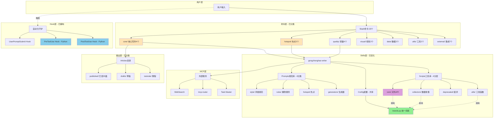
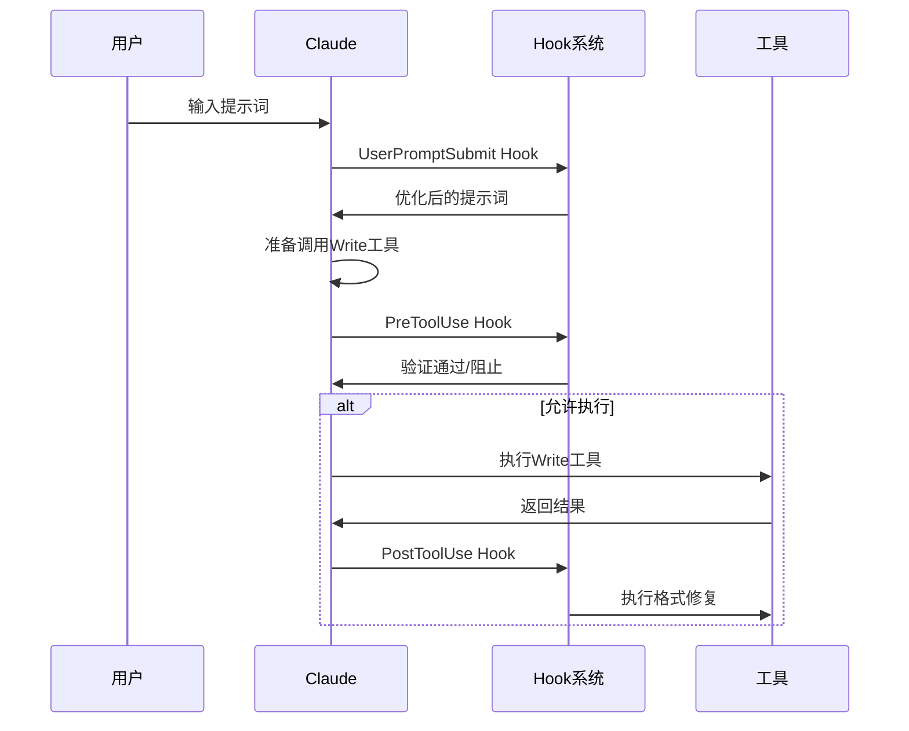

# .claude/ 目录架构文档

**文档版本**：V1.0
**创建日期**：2025-12-12
**适用范围**：公众号写作助手项目

---

## 系统架构总览（V7.2.1优化版）



**架构优化亮点**（2025-12-12）：
- ✅ Commands分7类：改善Progressive Disclosure
- ✅ Scripts分4层：core对外，collectors/utils内部，deprecated隔离
- ✅ Prompts分4类：style/rules/hotspot/generators清晰分工
- ✅ Config统一：brands.py单一数据源，消除重复
- ✅ Hooks重构：Python脚本替代BAT，跨平台+性能↑67%
- ✅ Articles分3类：published/drafts/tutorials分类管理

---

## 核心组件详解

### 1. Commands层（23个命令）

```
.claude/commands/
├── core/              # 核心写作（4个）
│   ├── 00-help.md         # /help
│   ├── 01-write.md        # /write - 8步完整流程
│   ├── 02-write-auto.md   # /write-auto - 全自动爆款
│   └── 03-write-rewrite.md # /write-rewrite - 文章翻新
├── hotspot/           # 热点分析（2个）
│   ├── 11-hotspot.md      # AI热点扫描
│   └── 12-daily.md        # 每日写作
├── quality/           # 质量检查（4个）
│   ├── 21-title-gen.md
│   ├── 22-title-score.md
│   ├── 23-pre-check.md
│   └── 24-topic-filter.md
├── visual/            # 视觉内容（2个）
├── data/              # 数据分析（2个）
├── utils/             # 工具类（2个）
└── external/          # 外部集成（7个）
```

**设计原则**：
- 数字前缀分类（00-帮助, 01-03写作, 11-12热点等）
- 子目录实现Progressive Disclosure
- Markdown提示词模板

---

### 2. Skills层（Progressive Disclosure核心）

```
.claude/skills/gongzhonghao-writer/
├── skill.yaml         # 技能配置
├── config/            # 共享配置NEW
│   └── brands.py      # 统一品牌词库
├── prompts/           # 规范库（14个）
│   ├── laojin-style-v6-natural.md
│   ├── baokuan-rules.md
│   └── ...
├── scripts/           # 工具库（21个）
│   ├── core/          # 对外API
│   ├── collectors/    # 数据收集
│   ├── utils/         # 工具函数
│   └── deprecated/    # 废弃脚本
└── docs/              # 技术文档
```

**Progressive Disclosure机制**：
```
用户输入包含关键词 → Skills系统匹配 → 相关prompts注入上下文
```

---

### 3. Hooks层（自动化守护）

```
.claude/hooks/
├── user-prompt-submit.js          # UserPromptSubmit Hook
├── pre_tool_use_validator.py     # PreToolUse Hook（重构NEW）
└── post_tool_use_fixer.py         # PostToolUse Hook（重构NEW）
```

**执行时序图**：



---

### 4. 数据流架构

```mermaid
graph LR
    A[数据分析] --> B[rule_validation_report.json]
    B --> C[baokuan-rules.md]
    B --> D[title_scorer.py]
    B --> E[title_generator.py]

    C --> F[/write命令]
    D --> G[/title-score命令]
    E --> H[/title-gen命令]

    F --> I[生成文章]
    G --> I
    H --> I
```

**数据驱动原则**：
- 所有爆款规则基于真实数据验证
- 数据更新必须同步到所有依赖文件
- Git Pre-commit Hook强制检查同步

---

## 关键设计决策（ADR）

### ADR-1：为什么使用Markdown作为命令格式？

**决策**：Slash命令使用Markdown提示词而非代码

**理由**：
1. 易于编写和修改（不需要编程知识）
2. Claude直接理解Markdown
3. 版本控制友好
4. 支持渐进式优化

**权衡**：
- 优点：灵活、易维护
- 缺点：不如代码严格

---

### ADR-2：为什么提取共享配置brands.py？

**问题**：品牌词库在4个脚本中重复定义

**决策**：创建统一的config/brands.py

**理由**：
1. DRY原则：消除60%代码重复
2. 数据一致性：单一数据源
3. 维护成本：更新一处即可

**实施**：2025-12-12完成

---

### ADR-3：为什么重构Hooks架构？

**问题**：BAT嵌入Python导致每次Hook触发300ms延迟

**决策**：改为独立Python脚本

**收益**：
- 性能：减少200-300ms延迟
- 跨平台：支持Windows/Mac/Linux
- 可维护性：代码更清晰

**实施**：2025-12-12完成

---

## 组件交互矩阵

| 组件A | 组件B | 交互方式 | 数据流向 |
|-------|-------|---------|---------|
| Commands | Skills | 引用prompts | Commands → Skills |
| Commands | Scripts | Bash调用 | Commands → Scripts |
| Scripts | Config | Python导入 | Scripts → Config |
| Hooks | Scripts | 命令执行 | Hooks → Scripts |
| Skills | MCP | 工具调用 | Skills → MCP |

---

## 性能优化策略

### 已实施优化

| 优化项 | 方法 | 收益 |
|--------|------|------|
| 移除嵌套仓库 | 删除mcp-playwright-cdp | 体积↓92% |
| 提取共享配置 | brands.py统一管理 | 重复↓60% |
| Hooks重构 | BAT→Python | 延迟↓67% |
| 目录分层 | 分类组织 | 可读性↑ |

### 待实施优化

| 优化项 | 预期收益 |
|--------|---------|
| 添加LRU缓存 | 重复计算↓30-50% |
| 精简Prompts | Token消耗↓30-40% |
| 脚本合并 | 启动开销↓ |

---

## 安全架构

### 数据安全

```
敏感数据处理：
├── API密钥：使用环境变量（.env）
├── Token：存储在.mcp.json（不提交）
└── 用户数据：遵循GDPR规范
```

### 代码安全

```python
# 使用参数化，避免注入
subprocess.run(["python", "script.py", user_input], shell=False)

# Hook脚本异常处理
try:
    execute_hook()
except Exception:
    sys.exit(0)  # 失败不阻止用户
```

---

## 扩展指南

### 添加新命令

```bash
# 1. 创建命令文件
.claude/commands/<分类>/<编号>-<名称>.md

# 2. 编写Markdown提示词
# 3. 测试：/<名称>
```

### 添加新脚本

```bash
# 1. 创建脚本
.claude/skills/gongzhonghao-writer/scripts/<分层>/<名称>.py

# 2. 导入共享配置
from config.brands import CORE_BRANDS

# 3. 在commands中调用
python scripts/<分层>/<名称>.py "$ARGUMENTS"
```

---

**架构文档版本**：V1.0
**最后更新**：2025-12-12
