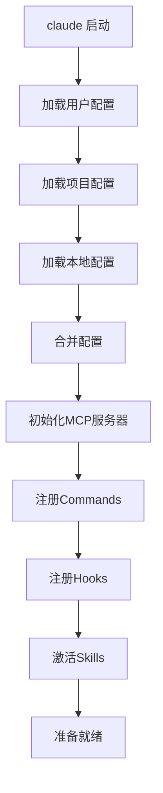
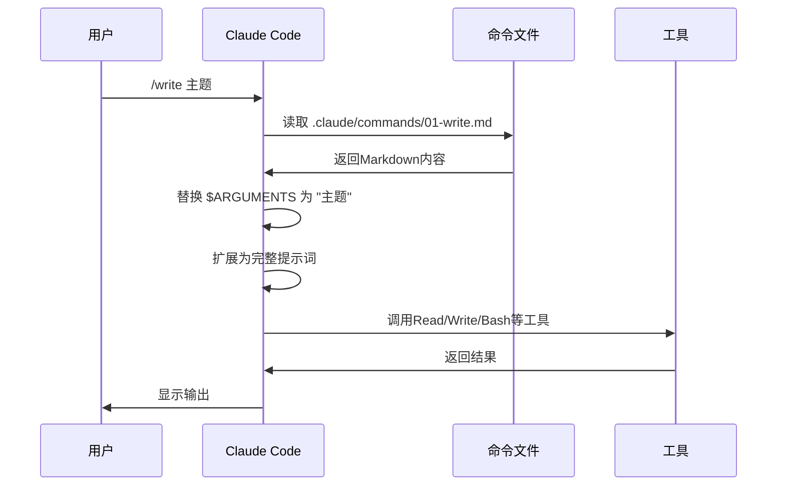
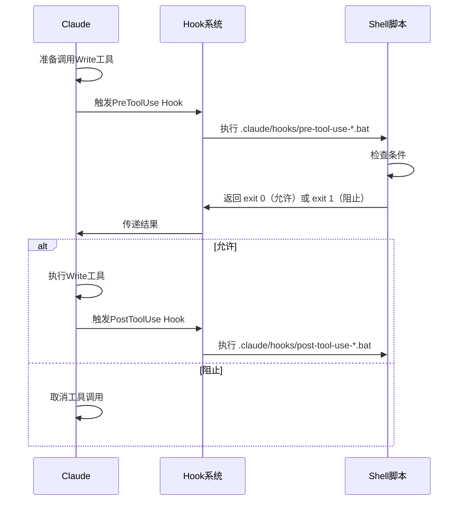

# Claude Code运行机制深度解析

**文档版本**：V1.0
**创建日期**：2025-12-12
**适用对象**：.claude/目录架构设计者

---

## 核心运行机制

### 1. 启动加载顺序



**配置优先级**：
```
本地配置(.claude/settings.json)
    ↓ 覆盖
项目配置(当前目录/.claude/)
    ↓ 覆盖
用户配置(~/.claude/)
    ↓ 覆盖
系统默认配置
```

### 2. Commands运行机制

#### 发现与注册

```
启动时扫描：
.claude/commands/*.md  (项目级)
    ↓
~/.claude/commands/*.md  (用户级)
    ↓
注册到命令表
    ↓
/命令名 触发执行
```

#### 执行流程



**关键点**：
- 命令文件是**Markdown格式的提示词模板**
- `$ARGUMENTS`会被实际参数替换
- 命令执行就是**发送提示词给Claude**

### 3. Hooks运行机制

#### Hook类型与触发时机

```typescript
type HookType =
  | 'UserPromptSubmit'    // 用户提交提示词后
  | 'PreToolUse'          // 工具调用前
  | 'PostToolUse'         // 工具调用后
  | 'ToolUseBlocked'      // 工具被阻止
  | 'AgentFinished';      // Agent完成
```

#### 执行流程



**关键点**：
- Hook是**Shell脚本**（.sh/.bat/.js）
- PreToolUse可以**阻止**工具调用（exit 1）
- PostToolUse可以**修改**工具结果

### 4. Skills运行机制

#### Progressive Disclosure原理

```
用户输入 → 主题分析
    ↓
Skills系统判断相关性
    ↓
相关度高的prompts注入上下文
    ↓
Claude根据扩展上下文响应
```

#### Skill结构

```
.claude/skills/gongzhonghao-writer/
├── skill.yaml              # 配置文件
├── prompts/               # 提示词库
│   ├── laojin-style.md    # 按需注入
│   ├── baokuan-rules.md   # 按需注入
│   └── ...
└── scripts/               # 工具脚本
    ├── quality_detector.py
    └── ...
```

**关键点**：
- Skill不是"立即执行"，而是**按需注入上下文**
- prompts文件会在相关时自动加载到系统提示词
- scripts由commands调用，不自动执行

### 5. 上下文注入机制

#### 注入顺序

```
1. 系统默认提示词
    ↓
2. CLAUDE.md（项目上下文）
    ↓
3. Skills prompts（按相关性）
    ↓
4. 用户提示词
    ↓
5. 历史对话（如有）
```

#### 总Token预算

```
200K总上下文
├── 系统提示词：~10K
├── CLAUDE.md：~5K
├── Skills prompts：~20K（动态）
├── 历史对话：~100K（动态）
└── 剩余可用：~65K
```

---

## 当前项目架构分析

### 目录结构

```
.claude/
├── commands/              # 20个Slash命令
│   ├── 00-help.md
│   ├── 01-write.md
│   ├── 02-write-auto.md
│   └── ...
├── hooks/                # Hook脚本
│   ├── user-prompt-submit.js
│   ├── pre-tool-use-research-validator.bat
│   └── post-tool-use-format-fixer.bat
├── skills/
│   └── gongzhonghao-writer/
│       ├── skill.yaml
│       ├── prompts/       # 12个规范文档
│       ├── scripts/       # 21个Python/JS脚本
│       ├── templates/     # 3个模板
│       └── docs/          # 技术文档
├── settings.json         # 项目配置
└── README.md            # 说明文档
```

### 关键发现

#### 优点

1. **模块化**：Commands按功能编号分类（00-help, 01-write, 11-hotspot等）
2. **Skills完整**：12个prompts覆盖写作规范
3. **Scripts丰富**：21个工具脚本

#### 潜在问题

1. **Hook脚本混用**：.bat（Windows）和.js（Node）混用可能有兼容性问题
2. **MCP服务器在Skill内**：mcp-playwright-cdp应该在项目根目录
3. **Scripts语言混杂**：Python和JavaScript混用，维护成本高

---

## 最佳实践对照

| 实践 | 当前状态 | 建议 |
|------|---------|------|
| **Commands命名** | ✅ 数字前缀分类 | 保持 |
| **Prompts模块化** | ✅ 12个独立文件 | 保持 |
| **Scripts统一语言** | ⚠️ Python+JS混用 | 统一为Python |
| **Hook跨平台** | ⚠️ .bat不跨平台 | 改为.js或.sh |
| **MCP位置** | ❌ 在skills/内 | 移到项目根 |
| **文档完整性** | ⚠️ 部分缺失 | 补充README |

---

**下一步**：等待4个专业Agent完成审查，汇总优化建议。
