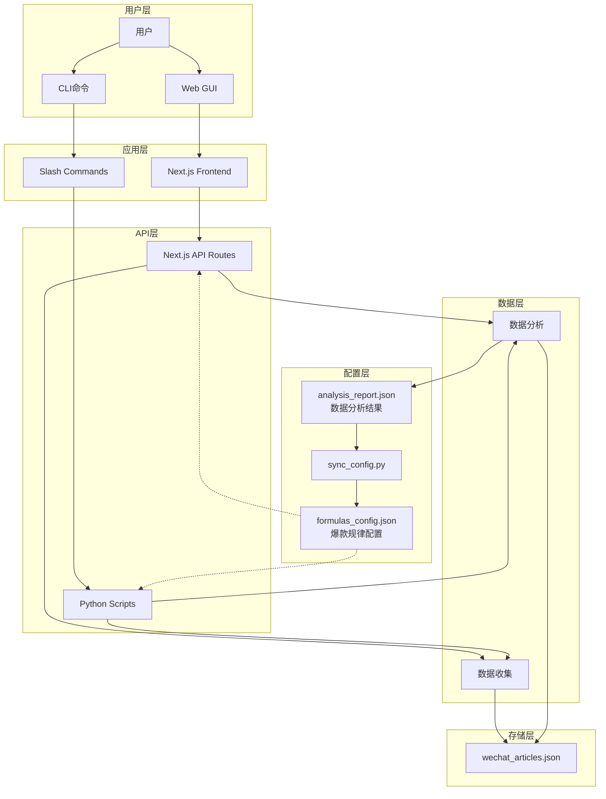
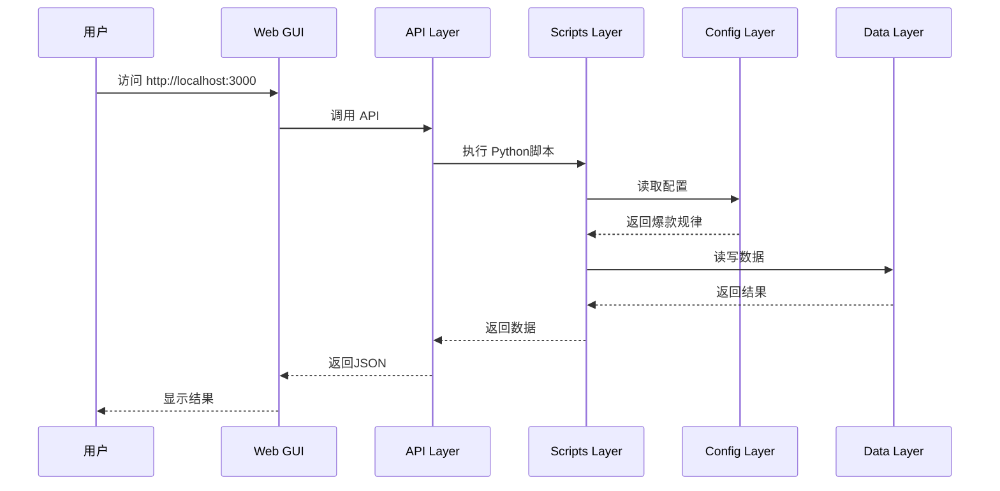

# 公众号写作助手

**版本**：V8.1 老金2.0进化版 | **更新**：2025-12-17 | **状态**：✅ 生产可用

---

## 🎯 项目简介

基于**Claude Code + Skills + Python**的公众号爆款文章生成系统，集成数据分析、热点扫描、标题优化、质量检测等完整工作流。

**V8.1 进化**：✨ **老金2.0融合版**
- 🔥 **保留老金DNA**：真实场景、数据支撑、手把手教程
- 🌟 **融合大众化**：语气温和、表达精炼、技术解释、友好互动
- 🎯 **统一人设**：不是分裂成两个人，而是老金自然进化

**核心特色**：
- 📊 **数据驱动**：基于82篇文章数据分析的爆款规律V8.0
- 🤖 **智能写作**：8步完整写作流程，质检通过率>90%
- 🔥 **热点追踪**：自动扫描AI热点，评估爆款潜力
- 🎨 **双端支持**：Web GUI + CLI命令，灵活使用
- ✨ **融合进化**：老金特色 + 大众友好，受众扩大3倍

---

## 🚀 快速开始

### 方式1：Web GUI（推荐新手）
```bash
cd web-app/frontend
npm install
npm run dev
# 访问 http://localhost:3000
```

### 方式2：CLI命令（推荐熟练用户）
```bash
/data-collect  # 数据收集
/write [主题]   # 开始写作
/pre-check     # 发布前检查
```

---

## 📊 架构概览

### 技术栈
- **前端**：Next.js 15 + React 18 + TypeScript + TailwindCSS
- **后端**：Python 3.11+ + FastAPI风格API
- **AI**：Claude Code + Skills系统
- **数据**：JSON配置驱动 + 微信公众号数据分析

### 架构图



### 数据流向



### 6层分层架构

| 层级 | 组件 | 说明 |
|------|------|------|
| **用户层** | Web GUI / CLI | `web-app/frontend/` / `.claude/commands/` |
| **应用层** | Next.js App / Slash Commands | 前端应用 + Markdown命令 |
| **API层** | 21个API路由 / Python脚本 | `app/api/` / `scripts/` |
| **业务逻辑层** | 数据收集、分析、标题生成、质检 | `scripts/core/` + `scripts/collectors/` |
| **配置层** | 3个JSON配置文件 | `config/formulas_config.json` 等 |
| **数据层** | wechat_articles.json + 分析报告 | `data/` |

### 设计原则

- **单一职责（SRP）**：config/ 只管配置，scripts/ 只管业务逻辑，api/ 只管接口
- **依赖倒置（DIP）**：上层依赖配置（JSON），不依赖具体实现
- **开闭原则（OCP）**：新增爆款公式只需修改配置，无需改代码

---

## 🎯 核心功能

### 📝 写作类（4个命令）
- `/write [主题]` - 完整8步写作流程
- `/write-auto [热点]` - 全自动爆款生成
- `/write-rewrite` - 文章翻新改写
- `/topic-filter [选题]` - V3双轨制选题过滤

### 🔥 热点类（2个命令）
- `/hotspot` - AI热点扫描+爆款评估
- `/daily` - 每日热点扫描+自动写作

### ✅ 质量检查（4个命令）
- `/title-gen [主题]` - 生成5个爆款标题
- `/title-score [标题]` - 7维度标题评分
- `/pre-check` - 发文前8维度检查
- `/topic-filter [选题]` - 选题可行性过滤

### 📊 数据分析（2个命令）
- `/data-collect` - 收集微信公众号数据
- `/data-analyze` - 深度分析文章数据

**完整命令列表**：29个命令，查看 `/help`

---

## 📁 项目结构

```
公众号写作助手/
├── README.md              # 项目说明（本文件）
├── ARCHITECTURE.md        # 架构文档
├── package.json          # 根项目配置
│
├── .claude/              # Claude Code配置
│   ├── commands/         # 29个Slash命令
│   ├── skills/           # gongzhonghao-writer Skill包
│   │   ├── config/       # 📍 配置中心（3个JSON）
│   │   ├── scripts/      # Python业务逻辑
│   │   └── prompts/      # 提示词模板
│   └── hooks/            # 自动化Hook
│
├── web-app/              # Web GUI应用
│   └── frontend/         # Next.js 15前端
│       ├── app/          # App Router
│       │   ├── page.tsx  # 主界面（6个Tab）
│       │   └── api/      # 📍 21个API路由
│       └── package.json
│
├── data/                 # 📍 数据层
│   ├── wechat_articles.json
│   └── YYYY-MM-DD_数据分析/
│
└── docs/                 # 文档中心
    ├── WORKFLOW.md
    └── reports/

📍 = 核心模块
```

---

## 🔧 数据驱动架构

### 配置中心（Config-Driven）
- `formulas_config.json` - 爆款公式配置
- `brands_config.json` - 品牌词库配置
- `quality_config.json` - 质检标准配置

### 数据驱动流程
```
数据收集（/data-collect）
    ↓
数据分析（/data-analyze）→ analysis_report.json
    ↓
自动同步（sync_config.py）→ 更新配置文件
    ↓
脚本自动生效（无需改代码）
```

---

## 📖 文档

- [web-app/README.md](./web-app/README.md) - Web GUI说明
- [CLAUDE.md](./CLAUDE.md) - AI上下文配置

---

## 🔄 工作流程

### 快速模式（15分钟）
```bash
/write-auto [热点关键词]  # 全自动生成
```

### 完整模式（30分钟）
```bash
/topic-filter [选题]  # 1. 过滤选题
/write [主题]         # 2. 完整8步写作
/pre-check            # 3. 发布前检查
```

### 数据驱动模式
```bash
/data-collect  # 1. 收集数据（每周）
/data-analyze  # 2. 分析爆款规律
# 3. 配置自动更新（sync_config.py）
```

---

## 🎯 命令速查

### 核心命令（最常用）
- `/write [主题]` - 完整8步写作
- `/topic-filter [选题]` - 写作前过滤
- `/pre-check` - 发布前检查
- `/title-gen [主题]` - 生成5个标题
- `/hotspot` - AI热点扫描

**完整29个命令**：运行`/help`查看
