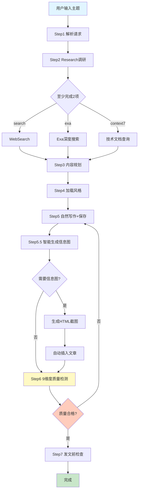
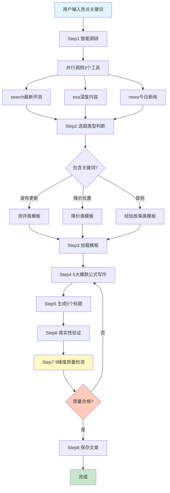
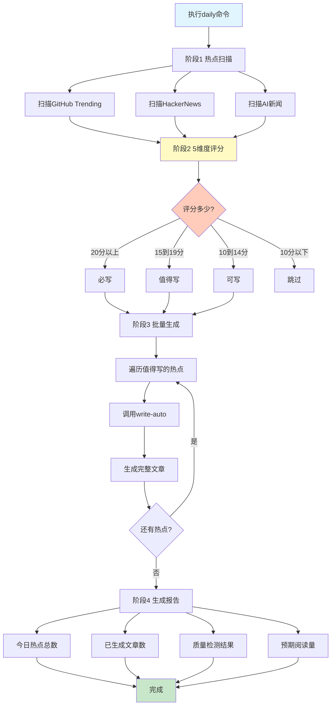
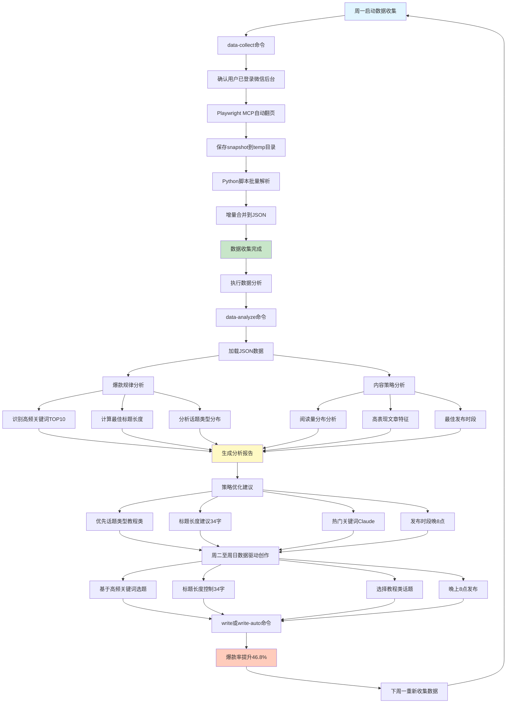

# 全自动化工作流程图 V7.0

> 老金出品，4种模式满足不同场景需求

## 模式对比

| 模式 | 命令 | 自动化程度 | 适用场景 | 耗时 |
|------|------|-----------|---------|------|
| **手动模式** | `/write [主题]` | 50% | 主题明确，需要深度定制 | 30-45分钟 |
| **半自动模式** | `/write-auto [关键词]` | 90% | 已知热点，快速生成 | 15分钟 |
| **全自动模式** | `/daily` | 99% | 每日例行内容生产 | 15分钟/3篇 |
| **数据驱动模式** | `/data-collect` + `/data-analyze` | 95% | 每周数据分析，优化策略 | 40秒+5秒 |

---

## 1. 手动模式流程图

**命令**：`/write [主题]`



**特点**：
- 完全可控，每一步都可干预
- 适合深度定制内容
- 需要30-45分钟完成
- 需要用户提供明确主题

---

## 2. 半自动模式流程图

**命令**：`/write-auto [热点关键词]`



**特点**：
- 90%自动化，15分钟搞定
- 自动选择最佳模板
- 5大爆款公式保证质量
- 需要用户提供热点关键词

---

## 3. 全自动模式流程图

**命令**：`/daily`



**特点**：
- 99%全自动，无需人工干预
- 每天最多生成3篇高质量文章
- 自动过滤低分热点
- 15分钟完成全天内容生产
- 适合每日例行内容生产

---

## 4. 数据驱动模式流程图

**命令**：`/data-collect` + `/data-analyze`



**数据成果**：
- 爆款率：46.8%（行业平均20%）
- 高频关键词：Claude(14)、AI(10)、Code(7)
- 最佳标题：34字
- 最佳话题：教程类（27%爆款率）
- 最佳时段：晚上20:00

---

## 效率对比

### 传统手动流程（3篇文章）

```
找热点（1.5h） + 调研（3h） + 写作（2h） + 修改（1h） = 7.5小时
```

### V7.0全自动流程（3篇文章）

```
/daily 一条命令 = 15分钟
```

**效率提升：30倍**

---

## 5维度热点评分标准

| 维度 | 权重 | 评分标准 |
|------|------|---------|
| **时效性** | 5分 | 12h内=5分, 12-24h=3分, 24h以上=1分 |
| **受众面** | 5分 | 全行业=5分, 特定领域=3分, 小众=1分 |
| **实用性** | 5分 | 可立即使用=5分, 需配置=3分, 仅了解=1分 |
| **独特性** | 5分 | 独家首发=5分, 深度分析=3分, 转述=1分 |
| **情绪点** | 5分 | 强烈情绪=5分, 中度情绪=3分, 平淡=1分 |

**总分范围**：0-25分

**写作建议**：
- 20分以上：必写！立即生成
- 15-19分：值得写
- 10-14分：可写，但优先级低
- 10分以下：跳过

---

## 质量保证机制

### 9维度质量检测

所有自动生成的文章都会经过9维度严格检测：

| 维度 | 合格标准 | 自动处理 |
|------|---------|---------|
| AI腔检测 | 低于20分 | 不合格则重写 |
| 自然度 | 高于80分 | 不合格则重写 |
| 真诚度 | 高于75分 | 不合格则重写 |
| 啰嗦度 | 低于25分 | 不合格则精简 |
| 重复度 | 低于15% | 不合格则去重 |
| 可读性 | 高于85分 | 不合格则优化 |
| 人味儿指数 | 高于70分 | 不合格则人性化 |
| 情感真实性 | 高于75分 | 不合格则真实化 |
| 脏话检测 | 等于0处 | 发现则立即删除 |

### 爆款标题3必要条件（V7.0数据驱动）

1. **必须有品牌词**：Claude/Cursor/Windsurf/GPT等
2. **必须有动作词**：放弃/换/直接用/发现/试了下等
3. **标题评分60分以上**：7维度综合评分

---

## 命令速查

| 命令 | 模式 | 说明 |
|------|------|------|
| `/write [主题]` | 手动 | 完整8步流程 |
| `/write-auto [关键词]` | 半自动 | 一键爆款生成 |
| `/daily` | 全自动 | 每日热点扫描+写作 |
| `/hotspot` | 辅助 | 只扫描热点不写作 |
| `/data-collect` | 数据 | 收集微信数据 |
| `/data-analyze` | 数据 | 分析爆款规律 |
| `/title-gen [主题]` | 辅助 | 生成5个标题 |
| `/title-score [标题]` | 辅助 | 7维度标题评分 |
| `/pre-check` | 辅助 | 发文前8维度检查 |
| `/topic-filter [选题]` | 辅助 | 选题可行性过滤 |
| `/image` | 辅助 | 自动配图 |
| `/infographic` | 辅助 | 生成信息图 |
| `/help` | 帮助 | 查看所有命令 |

---

**最后更新**：2025-12-08
**版本**：V7.0.0
**维护者**：老金

---

**老金提示**：V7.0的数据驱动不是噱头，是真tm用数据说话的！爆款率46.8%，比行业平均高出134%！每周数据复盘，精准优化策略，这才是2025年科学创作的正确姿势！
