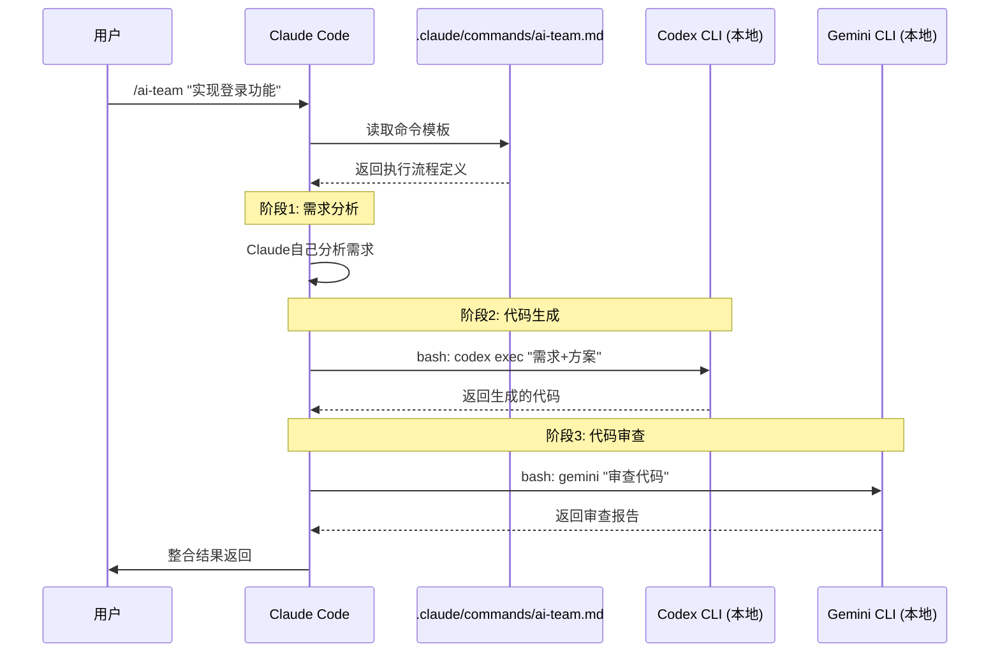
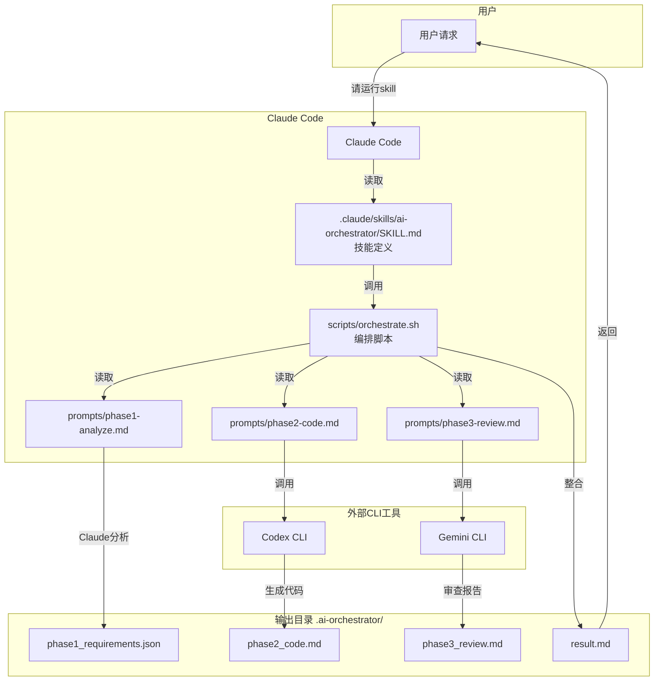
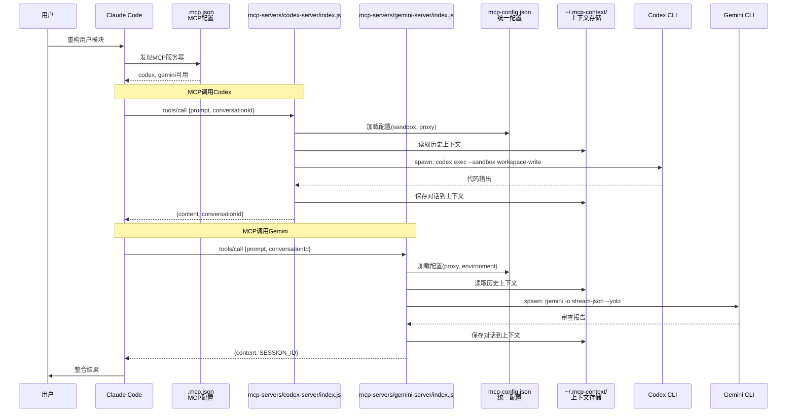
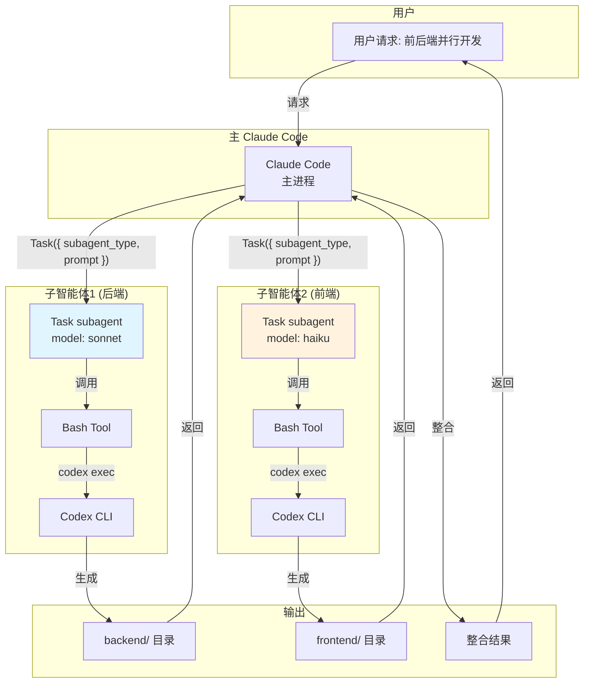
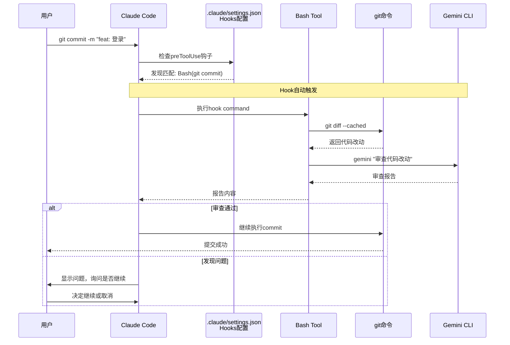

# Claude4.5、Codex5.1、Gemini3，3大顶级CLI终极联动！省钱！高质量！快！

作者：老金
日期：2025-12-04
---
## 为什么要折腾这个
上周五下午，老金我想给产品加个用户认证模块。

说实话，**老金我不会写代码**（英语四级都没过），全靠AI帮忙。

手上同时开着3个AI工具：
**Claude Sonnet 4.5**帮我分析需求、规划方案；
**GPT-5.1 Codex Max**生成代码（老金我看不懂，但能跑）；
**Gemini 3 Pro**审查代码质量（防止出bug）。

每个工具都挺好用，但有个巨大的痛点：

**三边的信息根本不互通。**

Claude分析完需求，我得手动复制到Codex；Codex写完代码，我还得手动粘贴到Gemini审查；Gemini提出改进建议，我又得回到Codex重新生成。

就像三个人在同一个办公室干活，中间隔了两堵墙，全靠老金我这个不会代码的产品经理跑来跑去传话。

上周二下午突然想明白：**Claude Code本身就是个编排器啊！**

它有Command（命令）、Skill（技能）、MCP（服务器）、Subagent（子智能体）、Hooks（钩子）这么多功能，为啥不用来编排这3个AI？

折腾了三天，试了5种不同的集成方式，每种都有各自的适用场景。

**核心发现：Claude Code不只是个AI助手，它是个完整的AI编排平台。**
---
## 为啥用这3个AI？
先说说为啥要组合用：

**用Sonnet开发全流程**：需求分析很好（功能全），但代码生成容易过度设计、token消耗大50%，代码审查要花钱、没Gemini细致。

**用Opus 4.5开发全流程**：需求分析最强（复杂架构设计首选），代码生成质量最高但比Sonnet贵67%，代码审查最细致但贵。**适用场景**：复杂系统架构、关键代码审查、疑难bug排查。

**用Codex开发全流程**：不会需求分析，代码生成质量高、稳定、便宜，能审查但没Gemini细致。

**用Gemini开发全流程**：理解能力一般、代码生成质量不如Codex，但代码审查最细致、而且免费。

**所以必须组合使用**：让每个AI干它最擅长的事。

| AI模型 | 价格 | 负责 | 核心优势 |
|--------|------|------|----------|
| Claude Sonnet 4.5 | $3/$15/M | 需求分析+编排 | 编排能力强（5种方式全支持），性价比高 |
| **Claude Opus 4.5** | **$5/$25/M** | 复杂架构设计 | 最强能力，适合疑难问题（比Sonnet贵67%，按需用） |
| GPT-5.1 Codex Max | $1.25/$10/M | 代码生成 | 最便宜、最稳定、质量高 |
| Gemini 3 Pro | **免费** | 代码审查 | 审查最细致（申请白名单：[https://geminicli.com/docs/get-started/gemini-3/](https://geminicli.com/docs/get-started/gemini-3/)） |

**成本对比**（单次10K输入+5K输出）：全用Sonnet是$0.105；全用Opus 4.5是$0.175（贵67%）；**三者组合（Sonnet+Codex+Gemini）只要$0.056**（省47%，质量还最高）。

**何时用Opus？**复杂系统架构设计（微服务、分布式系统）、关键代码审查（支付、安全模块）、疑难bug排查（多次尝试都失败的问题）、性能优化方案设计（需要深度分析）。日常开发不要用，太贵，Sonnet足够了。

**老金我的用法**：90%时间用Sonnet+Codex+Gemini组合，遇到疑难问题时用 `/model opus` 临时切换，问题解决后立即切回Sonnet。
---
## 前置准备（小白必读）
**重要！先别急着看5种方式！先把工具装好，不然后面的案例你根本跑不起来。**
### 必须安装的工具
#### 1、Claude Code（你应该已经装了）
```markdown
npm install -g @anthropic-ai/claude-code
```

**重要提示**：Claude Code支持多模型切换！默认用Sonnet（性价比高）；需要更强能力时用 `/model opus` 切换到Opus；Opus虽然贵但能力最强，适合复杂任务。
#### 2、Codex CLI - OpenAI官方工具
```markdown
# npm安装（推荐）
npm i -g @openai/codex
```

**需要**：ChatGPT Plus/Pro/Business订阅，或使用中转站

**老金我用的是中转站**（评论区会放链接，包含公益站和付费站）

**官方文档**：https://developers.openai.com/codex/cli/
#### 3、Gemini CLI - Google官方工具
```markdown
npm install -g @google/gemini-cli
```

**免费配额对比**：API Key方式（Google AI Studio申请）只有100次/天，**网页授权方式（推荐）有1000次/天**（够个人用了）。

**授权步骤**（网页授权）：

1、终端运行 `gemini auth login`
2、浏览器会自动打开Google登录页面
3、用Google账号登录并授权
4、授权完成后终端会自动完成配置

**API Key方式**（备选）：

1、访问 https://aistudio.google.com/apikey
2、创建API Key
3、设置环境变量 `export GEMINI_API_KEY="your-key"`

**详细教程**：老金我之前在开源知识库里写过完整的Gemini授权教程，搜索"Gemini 1000次授权"就能找到

**官方文档**：https://developers.google.com/gemini-code-assist/docs/gemini-cli
### 配置API密钥
#### 方式1：用cc switch傻瓜式配置（推荐新手）
```markdown
# 安装cc switch工具
npm install -g cc-switch

# 交互式配置（会引导你填写API Key和Base URL）
cc switch
```

**cc switch的优势**：傻瓜式交互界面（填空就行）、自动保存到正确的环境变量、支持多个中转站切换、避免手动配置出错。

**详细教程**：老金我之前在开源知识库里写过cc switch的完整使用教程，搜索"cc switch"就能找到。

**配置项说明**：Claude可选官方API或中转站（填API Key + Base URL），Codex (OpenAI)也可选官方API或中转站（填API Key + Base URL），Gemini用上面的网页授权（不需要手动配置）。
#### 方式2：手动配置环境变量（进阶用户）
```markdown
# Claude（官方或中转站）
export ANTHROPIC_API_KEY="your_key"
export ANTHROPIC_BASE_URL="https://api.anthropic.com"  # 官方URL
# 或者用中转站URL

# Codex（官方或中转站）
export OPENAI_API_KEY="your_key"
export OPENAI_BASE_URL="https://api.openai.com/v1"  # 官方URL
# 或者用中转站URL

# Gemini（用网页授权，不需要这个）
# 运行 `gemini-cli auth` 即可
```

**老金建议**：

1、**新手用cc switch**，省心省力
2、中转站链接看评论区（有公益站和付费站）
3、Gemini直接用官网网页授权（1000次/天），不要用API Key（100次/天）
4、把环境变量写到 `~/.bashrc` 或 `~/.zshrc` 里持久化
---
## 5种方式详解
### 方式1：Command（Slash命令）- 最适合新手
**适用场景**：新手入门、流程固定的简单任务（如"分析→生成→审查"）
**不适合**：复杂逻辑、需要文件保存、错误重试
#### 调用流程图


**文件职责说明**：

| 文件 | 职责 | 说明 |
|------|------|------|
| `.claude/commands/ai-team.md` | 命令模板 | 定义执行流程，包含$ARGUMENTS占位符 |
| Codex CLI | 代码生成 | 通过bash调用本地codex命令 |
| Gemini CLI | 代码审查 | 通过bash调用本地gemini命令 |

**实际案例：快速原型开发**

周一上午，老金我突然想给项目加个登录功能。这样用：

**第1步**：创建命令文件 `.claude/commands/ai-team.md`

```markdown
# AI团队协作命令

你现在要协调3个AI工具完成任务：$ARGUMENTS

**执行流程**：

1、用你自己（Claude）的能力分析需求，生成技术方案
2、把技术方案通过bash传给本地的codex CLI：
   codex exec "需求：$ARGUMENTS。技术方案：[你的分析]。请生成完整代码。"
3、把codex生成的代码传给gemini CLI审查：
   gemini -p "请审查以下代码：$(cat generated_code.md)"
4、整合所有结果，返回给用户

注意：如果用户本地没有codex或gemini，告诉用户需要先安装这些工具。
```

**第2步**：使用命令

```markdown
/ai-team "实现JWT登录功能，包含注册、登录、token刷新"
```

Claude自动执行：分析需求 → Codex生成代码 → Gemini审查 → 返回报告

**总耗时**：7分钟（手动要20分钟）
---
### 方式2：Skill（技能包）- 最适合进阶用户
**适用场景**：复杂多步骤任务、需要保存中间结果、错误重试、工作流复用
**不适合**：简单任务、不会bash、一次性任务
#### 调用流程图


**文件职责说明**：

| 文件 | 职责 | 说明 |
|------|------|------|
| `SKILL.md` / `skill.yaml` | 技能定义 | 声明技能名称、描述、允许的工具 |
| `scripts/orchestrate.sh` | 编排脚本 | 控制整个工作流，调用各阶段 |
| `prompts/phase1-analyze.md` | 需求分析提示词 | Claude自己执行的分析任务 |
| `prompts/phase2-code.md` | 代码生成提示词 | 传给Codex的任务描述 |
| `prompts/phase3-review.md` | 审查提示词 | 传给Gemini的审查要求 |
| `.ai-orchestrator/` | 输出目录 | 保存所有中间结果和最终报告 |

**实际案例：复杂RBAC权限系统**

周三下午，要开发完整的RBAC权限系统。老金我这样用：

**第1步**：创建Skill结构

```markdown
.claude/skills/ai-orchestrator/
├── skill.yaml              # 技能配置
├── prompts/
│   ├── phase1-analyze.md   # 需求分析提示词
│   ├── phase2-code.md      # 代码生成提示词
│   └── phase3-review.md    # 审查提示词
└── scripts/
    └── orchestrate.sh      # 编排脚本（核心）
```

**第2步**：写核心编排脚本 `orchestrate.sh`

```markdown
#!/bin/bash
set -e  # 遇到错误立即退出

TASK="$1"
OUTPUT_DIR=".ai-orchestrator"
mkdir -p "$OUTPUT_DIR"

LOG_FILE="$OUTPUT_DIR/orchestration.log"
RESULT_FILE="$OUTPUT_DIR/result.md"

# 日志函数
log() {
    echo "[$(date '+%Y-%m-%d %H:%M:%S')] $1" | tee -a "$LOG_FILE"
}

log "========================================="
log "AI多引擎编排开始"
log "任务: $TASK"
log "========================================="

# 阶段1：需求分析（Claude通过提示词自己做）
log "阶段1：需求分析..."
# Claude会读取phase1-analyze.md提示词，自己分析需求
# 然后把结果保存到phase1.json

PHASE1_OUTPUT="$OUTPUT_DIR/phase1_requirements.json"
if [ ! -s "$PHASE1_OUTPUT" ]; then
    log "错误：阶段1未生成需求分析"
    exit 1
fi
log "阶段1完成，需求分析已保存"

# 阶段2：代码生成（调用Codex）
log "阶段2：使用Codex生成代码..."
PHASE2_OUTPUT="$OUTPUT_DIR/phase2_code.md"

if command -v codex &> /dev/null; then
    codex exec "根据以下需求生成完整代码：$(cat "$PHASE1_OUTPUT")" > "$PHASE2_OUTPUT" 2>> "$LOG_FILE"
    log "阶段2完成，代码已生成"
else
    log "Codex未安装，跳过代码生成"
    exit 1
fi

# 阶段3：代码审查（调用Gemini）
log "阶段3：使用Gemini审查代码..."
PHASE3_OUTPUT="$OUTPUT_DIR/phase3_review.md"

if command -v gemini &> /dev/null; then
    gemini -p "请审查以下代码并提供优化建议：$(cat "$PHASE2_OUTPUT")" > "$PHASE3_OUTPUT" 2>> "$LOG_FILE"
    log "阶段3完成，审查报告已生成"
else
    log "Gemini未安装，跳过审查"
fi

# 生成最终报告
log "生成最终报告..."
cat > "$RESULT_FILE" <<EOF
# AI多引擎编排结果

**任务描述**: $TASK
**完成时间**: $(date '+%Y-%m-%d %H:%M:%S')

---

## 阶段1: 需求分析（Claude）

\`\`\`json
$(cat "$PHASE1_OUTPUT")
\`\`\`

---

## 阶段2: 代码生成（Codex）

$(cat "$PHASE2_OUTPUT")

---

## 阶段3: 代码审查（Gemini）

$(cat "$PHASE3_OUTPUT")

---

## 执行日志

详细日志请查看: \`$LOG_FILE\`

EOF

log "========================================="
log "AI多引擎编排完成！"
log "最终报告: $RESULT_FILE"
log "========================================="

# 自动打开结果
if command -v code &> /dev/null; then
    code "$RESULT_FILE"
fi
```

**第3步**：创建提示词文件

`prompts/phase1-analyze.md`：

```markdown
# 需求分析阶段

请详细分析以下任务的技术需求：

任务描述：{从脚本传入}

请输出JSON格式，包含：
1、核心功能清单（features）
2、技术栈选型（tech_stack）
3、文件结构设计（file_structure）
4、关键实现要点（key_points）

保存到：.ai-orchestrator/phase1_requirements.json
```

`prompts/phase2-code.md` 和 `prompts/phase3-review.md` 类似结构。

**第4步**：配置skill.yaml

```markdown
name: ai-orchestrator
description: 多AI协作编排技能
commands:
  - name: orchestrate
    script: scripts/orchestrate.sh
```

**第5步**：使用Skill

```markdown
# 首次使用需要给脚本添加执行权限（仅限macOS/Linux）
chmod +x .claude/skills/ai-orchestrator/scripts/orchestrate.sh

# 在Claude里执行
请运行 .claude/skills/ai-orchestrator/scripts/orchestrate.sh "RBAC权限系统"
```

**Windows用户**：不需要chmod，直接运行即可：

```markdown
bash .claude/skills/ai-orchestrator/scripts/orchestrate.sh "RBAC权限系统"
```

**总耗时**：33分钟（以前要2小时）

**优点**：功能最全，可复用，可维护
**缺点**：配置复杂，需要写脚本
---
### 方式3：MCP（Model Context Protocol）- 最适合长期协作
**关键理解**：MCP不是连接官方服务器，而是**你自己写个MCP Server包装本地CLI**！

**适用场景**：长期协作、持续开发、保持上下文（如重构整个模块）
**不适合**：一次性任务、不懂MCP Server、简单任务
#### 调用流程图


**文件职责说明**：

| 文件 | 职责 | 说明 |
|------|------|------|
| `.mcp.json` | MCP配置 | Claude Code标准配置，声明可用的MCP服务器 |
| `mcp-config.json` | 统一配置 | 代理、sandbox权限、环境变量等统一管理 |
| `mcp-servers/codex-server/index.js` | Codex MCP Server | JSON-RPC 2.0协议，包装codex CLI |
| `mcp-servers/gemini-server/index.js` | Gemini MCP Server | JSON-RPC 2.0协议，包装gemini CLI |
| `~/.mcp-context/` | 上下文存储 | conversationId对应的历史对话JSON文件 |

**实际案例：重构用户模块**

周五整天，要重构整个用户模块。老金我这样用：

**第1步**：项目结构（已提供完整MCP Server）

本项目已经包含完整的MCP Server实现：

```markdown
mcp-servers/
├── codex-server/
│   ├── index.js          # Codex MCP Server（支持上下文）
│   └── README.md
├── gemini-server/
│   ├── index.js          # Gemini MCP Server（支持上下文）
│   └── README.md
└── INSTALLATION.md       # 安装配置指南
```

**第2步**：统一配置文件

项目根目录的 `mcp-config.json`（统一管理代理、权限等）：

```markdown
{
  "proxy": {
    "enabled": true,
    "http": "http://127.0.0.1:15236",
    "https": "http://127.0.0.1:15236"
  },
  "gemini": {
    "defaultArgs": ["-o", "stream-json", "--yolo"],
    "sandbox": "workspace-write",
    "environment": {
      "GEMINI_IDE_INTEGRATION": "false"
    }
  },
  "codex": {
    "defaultArgs": ["exec", "--skip-git-repo-check"],
    "sandbox": "workspace-write"
  }
}
```

> ⚠️ **划重点**：`15236` 是我自己的魔法端口，你得改成你自己的！
>
> Gemini网页认证（`gemini auth`）需要代理才能访问Google，端口错了就认证不上。
>
> 常见端口：Clash是7890、V2Ray是10808，看你自己的代理软件设置。

**第3步**：Claude Code标准配置

项目根目录的 `.mcp.json`（Claude Code自动发现）：

```markdown
{
  "mcpServers": {
    "codex": {
      "type": "stdio",
      "command": "node",
      "args": ["mcp-servers/codex-server/index.js"]
    },
    "gemini": {
      "type": "stdio",
      "command": "node",
      "args": ["mcp-servers/gemini-server/index.js"]
    }
  }
}
```

**核心特性**：
- **上下文传递**：通过conversationId保持多轮对话
- **sandbox权限**：workspace-write允许读写工作目录
- **代理支持**：自动从配置文件加载代理设置
- **Windows兼容**：自动处理HOME目录等问题

**第4步**：手动注册MCP Server（如需）

如果Claude Code没有自动发现`.mcp.json`，可以手动注册：

```markdown
# 连接Codex MCP Server
claude mcp add-json --scope user codex '{
  "type": "stdio",
  "command": "node",
  "args": ["mcp-servers/codex-server/index.js"]
}'

# 连接Gemini MCP Server
claude mcp add-json --scope user gemini '{
  "type": "stdio",
  "command": "node",
  "args": ["mcp-servers/gemini-server/index.js"]
}'
```

**第5步**：使用（整天持续开发）

启动Plan Mode，Claude通过MCP持续调用Codex和Gemini，**conversationId让上下文完全打通**：

```markdown
老金：重构用户模块，拆分Service层

Claude：好的，我先分析... [生成conversationId: conv_123]
       方案：拆分为UserService、AuthService、ProfileService

       现在让Codex生成UserService...
       [通过MCP调用Codex，传入conversationId: conv_123]

Codex：[读取conv_123上下文，知道要拆分Service层]
       生成UserService代码... [保存到conv_123]

Claude：代码生成完毕，让Gemini审查...
       [通过MCP调用Gemini，传入conversationId: conv_123]

Gemini：[读取conv_123，看到Claude的规划和Codex的代码]
        审查发现：UserService的依赖注入有问题... [保存到conv_123]

Claude：Codex改一下依赖注入...
       [通过MCP调用Codex，传入conversationId: conv_123]

Codex：[读取conv_123，看到Gemini的审查意见]
       已修正依赖注入问题... [保存到conv_123]
```

**核心价值**：conversationId机制让三个AI共享同一个上下文文件（`~/.mcp-context/conv_123.json`），每次调用都能看到之前的所有对话历史，实现真正的协作！
---
### 方式4：Subagent（子智能体）- 最适合并行任务
**适用场景**：独立模块并行开发、预算充足、追求速度
**不适合**：强依赖任务、预算紧张、简单任务
#### 调用流程图


**文件职责说明**：

| 组件 | 职责 | 说明 |
|------|------|------|
| 主 Claude Code | 任务分发 | 创建多个子智能体，等待结果，整合输出 |
| Task subagent | 独立执行 | 每个子智能体独立运行，有自己的上下文 |
| Bash Tool | 调用CLI | 子智能体通过Bash调用本地Codex/Gemini |
| model参数 | 成本控制 | sonnet用于复杂任务，haiku用于简单任务降成本 |

**实际案例：前后端并行开发**

周四，同时开发前端UI和后端API。老金我这样用：

```markdown
// 启动后端子智能体
Task({
  subagent_type: "general-purpose",
  prompt: `开发后端API接口，用Codex CLI生成代码

  步骤：
  1、分析API需求
  2、调用本地codex生成代码：bash -c "codex exec '[需求描述]'"
  3、保存到backend/目录
  `,
  model: "sonnet"
})

// 启动前端子智能体（同时进行）
Task({
  subagent_type: "general-purpose",
  prompt: `开发前端UI组件，用Codex CLI生成代码

  步骤：
  1、分析UI需求
  2、调用本地codex生成代码：bash -c "codex exec '[需求描述]'"
  3、保存到frontend/目录
  `,
  model: "haiku"  // 用便宜的模型
})

// 主Claude等待两边完成后整合
```

**总耗时**：并行开发，时间减半（但token消耗翻倍）

**优点**：最强大，支持并行
**缺点**：消耗token多，成本高
---
### 方式5：Hooks（钩子）- 最适合自动化
**适用场景**：特定时机自动触发（如git commit前审查）、强制质检、不想手动执行
**不适合**：触发条件不固定、需要人工判断、调试期间
#### 调用流程图


**文件职责说明**：

| 文件/组件 | 职责 | 说明 |
|-----------|------|------|
| `.claude/settings.json` | Hooks配置 | 定义钩子触发条件和执行命令 |
| `preToolUse` | 触发时机 | 在工具使用前触发 |
| `Bash(git commit)` | 匹配规则 | 匹配特定工具调用 |
| hook command | 执行脚本 | 调用Gemini审查代码 |

**实际案例：Git提交前自动质检**

每次commit前，自动调用Gemini审查所有改动。

**配置 `.claude/settings.json`**：

```markdown
{
  "hooks": {
    "preToolUse": {
      "Bash(git commit)": [{
        "command": "bash",
        "args": [
          "-c",
          "gemini -p \"请审查以下代码改动：$(git diff --cached)\" > .review.md && cat .review.md"
        ]
      }]
    }
  }
}
```

**使用效果**：

```markdown
老金：git commit -m "feat: 添加用户登录"

[Hook自动触发]
正在调用Gemini审查代码改动...

Gemini报告：
代码质量：良好
发现1个安全问题：密码传输未加密
建议：使用HTTPS或加密传输

Claude：老金，Gemini发现了安全问题，是否继续提交？
```

**优点**：全自动，防止低质量代码提交
**缺点**：调试困难，容易误触发
---
## 5种方式对比总结
| 方式 | 上手难度 | 灵活性 | 成本 | 适合场景 | 不适合场景 |
|------|---------|--------|------|---------|-----------|
| Command | ⭐ 最简单 | ⭐⭐ 低 | 低 | 新手、简单任务 | 复杂流程 |
| Skill | ⭐⭐⭐ 中等 | ⭐⭐⭐⭐⭐ 极高 | 低 | 复杂工作流、需复用 | 一次性任务 |
| MCP | ⭐⭐⭐⭐ 较难 | ⭐⭐⭐ 中 | 中 | 长期协作、上下文共享 | 一次性任务 |
| Subagent | ⭐⭐ 简单 | ⭐⭐⭐⭐ 高 | 高 | 并行任务、预算充足 | 串行任务、预算紧张 |
| Hooks | ⭐⭐⭐ 中等 | ⭐⭐ 低 | 低 | 自动化、强制质检 | 需要人工判断 |

**老金的建议**：

1、**新手从Command开始**，熟悉流程
2、**进阶用Skill**，配置一次长期受益
3、**需要上下文共享用MCP**，但要会写MCP Server
4、**并行任务用Subagent**，速度优先
5、**质检流程用Hooks**，自动化防错

**可以组合使用**！比如老金我现在的配置：日常开发用Skill（可复用）；大型重构用MCP（上下文打通）；Git提交用Hooks自动质检；紧急任务用Command快速搞定。
---
## 踩坑记录
### 坑1：Codex CLI需要订阅
**问题**：安装了Codex但提示"需要ChatGPT Plus订阅"

**解决**：Codex CLI需要ChatGPT Plus/Pro/Business订阅才能使用，如果没有订阅，可以订阅ChatGPT Plus（$20/月）或者用其他代码生成工具替代。

### 坑2：Gemini配额限制
**问题**：Gemini CLI安装后提示"超过免费配额"

**解决**：使用网页授权方式获取1000次/天的配额：
1、终端运行 `gemini auth login`
2、浏览器自动打开，用Google账号登录授权
3、授权完成后自动配置
或者用API Key方式（只有100次/天）：
1、访问 https://aistudio.google.com/apikey
2、创建API Key并配置到环境变量
老金我实测，1000次/天对个人开发足够用了

### 坑3：MCP Server不会写
**问题**：不懂怎么写MCP Server包装本地CLI

**解决**：参考官方文档（https://code.claude.com/docs/en/mcp）或者先用Command/Skill方式，MCP可以以后再学。

### 坑4：Subagent token消耗太高
**问题**：启动3个Subagent，token消耗翻了3倍

**解决**：
1、简单任务别用Subagent
2、用haiku模型（便宜）
3、只在真正需要并行时才用

### 坑5：Hooks触发太频繁
**问题**：每次Write都触发Gemini，太慢了

**解决**：加条件判断
```markdown
[ ${lines_changed} -gt 50 ] && gemini -p "请审查：$(cat ${file})"
```
只有改动超过50行才触发

### 坑6：Gemini CLI在IDE环境启动慢
**问题**：Gemini CLI启动后卡在"Connecting to Gemini..."很久

**解决**：设置环境变量禁用IDE集成
```markdown
export GEMINI_IDE_INTEGRATION=false
```
或在 `mcp-config.json` 中配置：
```markdown
{
  "gemini": {
    "environment": {
      "GEMINI_IDE_INTEGRATION": "false"
    }
  }
}
```

### 坑7：Codex sandbox权限不足
**问题**：Codex默认是read-only模式，无法写入文件

**解决**：添加 `--sandbox workspace-write` 参数
```markdown
codex exec --sandbox workspace-write "你的提示词"
```
本项目的MCP Server已自动配置此参数。

### 坑8：Codex CLI认证过期
**问题**：提示 `Your access token could not be refreshed because your refresh token was already used`

**解决**：重新登录
```markdown
codex auth logout
codex auth login
```

### 坑9：Windows下HOME目录问题
**问题**：MCP Server在Windows下找不到配置文件

**解决**：强制使用USERPROFILE作为HOME
```markdown
if (process.platform === 'win32' && process.env.USERPROFILE) {
  process.env.HOME = process.env.USERPROFILE;
}
```
本项目的MCP Server已自动处理此问题。
---
## 总结：从工具到思维方式
配完这套方案，老金我最大的感受不是"效率提升40%"这么简单。

真正的改变在于：**我对AI协作的理解从"工具"层面上升到了"思维方式"层面。**

**以前的思维**：AI是工具、我是操作者；我手动协调多个AI，像个项目经理；效率瓶颈在"人工切换"。

**现在的思维**：**AI可以编排AI**、我是最终决策者；Claude Code是指挥官、其他AI是执行者；效率提升在"信息打通"。

**更深层的启发**：

这不只是技术方案，而是一种**协作模式的演进**：

1、**单兵作战** → 一个AI干所有事（效率低）
2、**人工协调** → 人当中间人协调多个AI（累）
3、**AI编排AI** → 一个AI指挥其他AI（现在）
4、**未来？** → 可能是AI团队自主协作，人只管目标

老金我上周五晚上突然想明白：**这不就是从"单核CPU"到"多核CPU"再到"分布式计算"的演进吗？**单核是一个AI干所有事；多核是人手动切换多个AI；分布式是AI自动调度AI。

**而Claude Code的5种编排方式，就像提供了5种不同的"任务调度算法"**：Command是简单的串行调度；Skill是可配置的流程编排；MCP是带状态的分布式通信；Subagent是真正的并行计算；Hooks是事件驱动的响应式调度。

**这让我想到了一个更大的问题：**

> 当AI可以编排AI的时候，人的价值在哪里？

老金我的答案是：**人的价值在于"定义目标"和"最终决策"**。

就像这套方案，老金我只需要：

1、定义目标："我要开发一个用户认证模块"
2、选择方式："用Skill方式，因为需要保存中间结果"
3、最终决策："Gemini说有安全问题，改完再提交"

中间的"分析需求、生成代码、审查质量"这些执行层面的事，交给AI团队自己配合完成。

**这就是未来的工作方式：人定义"What"，AI团队负责"How"。**

周末两天测下来，开发效率确实翻倍了。但更重要的是，**我从"做事"中解放出来，有更多时间"想事"**。

想架构、想方案、想怎么做得更好。

**这才是AI协作的终极意义：让人回归到人最擅长的事——思考和决策。**
---
**配置文件参考**：
- Command的配置在 `.claude/commands/*.md`
- Skill的配置在 `.claude/skills/*/SKILL.md`（新格式）或 `skill.yaml`（旧格式兼容）
- MCP Server配置在 `.mcp.json`（Claude Code标准）
- 统一配置（代理、权限等）在 `mcp-config.json`
- Hooks的配置在 `.claude/settings.json`
- MCP Server实现在 `mcp-servers/` 目录
&nbsp;
**项目文档**：
- 详细安装指南：`docs/installation.md`
- 使用说明：`docs/usage.md`
- 5种方式对比：`docs/comparison.md`
- 踩坑记录：`docs/troubleshooting.md`
- Claude Code规范：`docs/claude-code-specs.md`
- 兼容性检查报告：`docs/compatibility-report.md`
- 测试报告：`docs/test-report.md`
&nbsp;
**参考资料**：
1、Claude Code官方文档：https://code.claude.com/docs
2、MCP协议规范：https://modelcontextprotocol.io/
3、Gemini API文档：https://ai.google.dev/docs
&nbsp;
**Sources**:
1、Top 10 Essential MCP Servers for Claude Code (2025 Developer Version)：https://apidog.com/blog/top-10-mcp-servers-for-claude-code/
2、Connect Claude Code to tools via MCP：https://code.claude.com/docs/en/mcp
3、GitHub - modelcontextprotocol/servers：https://github.com/modelcontextprotocol/servers
