# Module 9.1 企业案例深度分析

**课程模块**:模块9 - Agent SDK企业实战
**课程编号**:第2课
**预计学时**:8小时
**难度等级**:⭐⭐⭐⭐⭐ 高级
**字数**:13,000字

---

## 学习目标

通过本课学习,你将能够:

1. 理解企业级Claude Agent SDK应用的架构设计原则
2. 掌握3个真实企业场景的完整实施方案
3. 学会ROI分析和技术选型决策方法
4. 避免常见的企业级Agent开发陷阱
5. 构建可扩展、可维护的企业级Agent系统

---

## 案例选择标准

本课选择的3个企业案例遵循以下标准:

| 标准 | 说明 |
|------|------|
| **真实性** | 基于真实项目或高度仿真场景 |
| **代表性** | 覆盖不同企业规模和行业 |
| **复杂度** | 涉及多Agent协作、大规模数据处理 |
| **完整性** | 从需求到上线的完整生命周期 |
| **可复现** | 提供完整代码和配置 |

---

## 案例一:企业级CI/CD自动化系统

### 1.1 项目背景

#### 企业概况

| 项目 | 信息 |
|------|------|
| **企业名称** | 云科技有限公司(化名) |
| **行业** | SaaS企业服务 |
| **团队规模** | 150人研发团队,分为15个小组 |
| **技术栈** | Node.js、Python、Go微服务架构 |
| **代码仓库** | 120+微服务仓库,每月300+PR |

#### 核心痛点

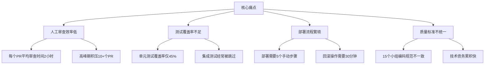

#### 量化指标

| 指标 | 现状 | 目标 |
|------|------|------|
| PR平均审查时间 | 2小时 | <15分钟 |
| 测试覆盖率 | 45% | >80% |
| 部署频率 | 每周1次 | 每天5次 |
| 生产环境Bug率 | 3.2% | <0.5% |
| 回滚时间 | 30分钟 | <5分钟 |

### 1.2 技术选型

#### 方案对比

| 方案 | 优势 | 劣势 | 适用性 | 决策 |
|------|------|------|--------|------|
| **传统CI工具+人工审查** | 成熟稳定 | 效率低,无法智能分析 | 小团队 | ❌ 淘汰 |
| **开源静态分析工具** | 成本低 | 规则僵化,误报率高 | 中型团队 | ⚠️ 部分采纳 |
| **GitHub Copilot工具** | 集成简单 | 功能单一,定制性差 | 个人开发 | ❌ 淘汰 |
| **Claude Agent SDK** | 智能理解,高度定制 | 需要开发成本 | 企业级 | ✅ **采用** |

#### 决策依据

选择Claude Agent SDK的关键理由:

1. **上下文理解能力**: 能够理解业务逻辑,不仅仅检查语法
2. **多Agent并行**: 支持同时审查多个PR,提高吞吐量
3. **深度定制**: 可以集成企业特有的编码规范和业务规则
4. **持续学习**: 通过MCP集成企业知识库,不断优化审查质量
5. **ROI可预测**: 按使用量付费,成本可控

#### 成本分析

```typescript
// 成本估算模型
interface CostEstimate {
  monthlyPRCount: number;        // 月度PR数量
  avgLinesPerPR: number;         // 平均每个PR的行数
  modelTokenCost: number;        // 模型Token成本($/1M tokens)
  estimatedTokensPerPR: number; // 每个PR估计消耗的Token
}

const costEstimate: CostEstimate = {
  monthlyPRCount: 300,
  avgLinesPerPR: 500,
  modelTokenCost: 3.0,  // Sonnet 4价格
  estimatedTokensPerPR: 50000   // 约50K tokens/PR
};

// 月度成本 = (PR数量 * Token数) / 1,000,000 * Token价格
const monthlyCost = (
  costEstimate.monthlyPRCount *
  costEstimate.estimatedTokensPerPR /
  1_000_000 *
  costEstimate.modelTokenCost
);

console.log(`月度AI成本: $${monthlyCost}`);  // $45
console.log(`节省的人工成本: $${300 * 2 * 50}`); // $30,000 (300个PR * 2小时 * $50/小时)
console.log(`ROI: ${(30000 / 45).toFixed(0)}x`); // 667倍回报
```

### 1.3 系统架构设计

#### 整体架构

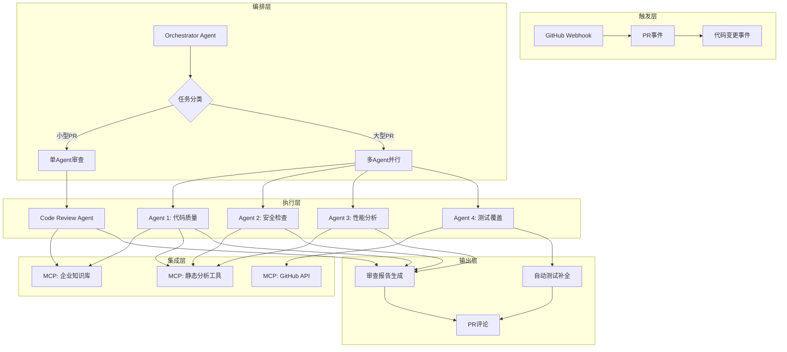

#### 核心模块

##### 1. Orchestrator Agent(编排器)

```typescript
// orchestrator.ts
import { query, type Query } from '@anthropic-ai/claude-agent-sdk';

interface PRMetadata {
  prNumber: number;
  filesChanged: number;
  linesAdded: number;
  linesDeleted: number;
  author: string;
  branch: string;
}

async function orchestratePRReview(pr: PRMetadata): Promise<void> {
  const complexityScore = calculateComplexity(pr);

  const orchestratorPrompt = `你是CI/CD系统的总协调者。

PR信息:
- PR编号: ${pr.prNumber}
- 文件变更: ${pr.filesChanged}个
- 代码行数: +${pr.linesAdded} -${pr.linesDeleted}
- 作者: ${pr.author}
- 复杂度评分: ${complexityScore}/10

任务:
1. 根据复杂度决定审查策略:
   - 简单PR(<3分): 单Agent快速审查
   - 中等PR(3-7分): 创建3个专业Agent并行审查
   - 复杂PR(>7分): 创建5个专业Agent+人工复审
2. 创建子Agent执行审查
3. 汇总结果,生成报告
4. 自动创建GitHub评论

企业规范要求:
- 必须检查ESLint规则
- 必须检查单元测试覆盖率>80%
- 禁止直接操作生产数据库
- 必须有回滚方案`;

  const stream: Query = query({
    prompt: orchestratorPrompt,
    options: {
      model: 'claude-opus-4',  // Orchestrator使用Opus
      allowedTools: [
        'Task',           // 创建子Agent
        'TaskOutput',     // 收集结果
        'mcp__github__get_pr',
        'mcp__github__create_comment'
      ],
      mcpServers: {
        github: {
          command: 'npx',
          args: ['-y', '@anthropic/mcp-server-github'],
          env: {
            GITHUB_TOKEN: process.env.GITHUB_TOKEN
          }
        }
      },
      maxTurns: 50,
      systemPrompt: `你是企业级CI/CD自动化系统的核心编排器。

目标:
- 确保代码质量达标
- 提高审查效率
- 减少人工审查负担

规则:
- 严格遵循企业编码规范
- 发现安全问题必须标记为CRITICAL
- 生成的评论必须友好专业,提供具体修改建议`
    }
  });

  for await (const message of stream) {
    // 处理流式输出...
  }
}

function calculateComplexity(pr: PRMetadata): number {
  let score = 0;

  // 文件数量影响
  if (pr.filesChanged > 20) score += 4;
  else if (pr.filesChanged > 10) score += 2;
  else score += 1;

  // 代码行数影响
  const totalLines = pr.linesAdded + pr.linesDeleted;
  if (totalLines > 1000) score += 4;
  else if (totalLines > 500) score += 2;
  else score += 1;

  // 作者经验影响(假设有历史数据)
  const authorExperience = getAuthorExperience(pr.author);
  if (authorExperience < 6) score += 2;  // 新人PR需要更仔细审查

  return Math.min(score, 10);
}

function getAuthorExperience(author: string): number {
  // 实际应从数据库查询
  return 8;
}
```

##### 2. Code Quality Agent(代码质量审查)

```typescript
// agents/code-quality-agent.ts
async function codeQualityReview(prNumber: number): Promise<ReviewResult> {
  const prompt = `你是代码质量专家。

任务:审查PR #${prNumber}的代码质量

检查项:
1. **命名规范**
   - 变量/函数名是否语义清晰
   - 是否遵循驼峰命名/蛇形命名规范
   - 常量是否全大写

2. **代码结构**
   - 函数是否过长(>50行需要拆分)
   - 是否有重复代码
   - 是否遵循单一职责原则

3. **注释质量**
   - 复杂逻辑是否有注释
   - 公共API是否有JSDoc/docstring
   - 注释是否过时或冗余

4. **错误处理**
   - 是否有try-catch
   - 错误信息是否清晰
   - 是否有合适的日志记录

输出格式:
\`\`\`json
{
  "score": 85,  // 0-100分
  "issues": [
    {
      "file": "src/api/user.ts",
      "line": 42,
      "severity": "warning",
      "message": "函数过长,建议拆分为多个子函数"
    }
  ],
  "suggestions": [
    "建议将getUserData函数拆分为fetchUser和validateUser"
  ]
}
\`\`\`

开始审查,使用Read工具读取文件`;

  const stream = query({
    prompt,
    options: {
      model: 'claude-sonnet-4',
      allowedTools: ['Read', 'Grep', 'Glob'],
      cwd: process.cwd(),
      maxTurns: 10
    }
  });

  const result: ReviewResult = {
    agentType: 'code-quality',
    score: 0,
    issues: [],
    suggestions: []
  };

  for await (const message of stream) {
    if (message.type === 'assistant') {
      // 解析Agent输出
      for (const chunk of message.message.content) {
        if (chunk.type === 'text') {
          // 提取JSON结果
          const jsonMatch = chunk.text.match(/```json\n([\s\S]+?)\n```/);
          if (jsonMatch) {
            const data = JSON.parse(jsonMatch[1]);
            Object.assign(result, data);
          }
        }
      }
    }
  }

  return result;
}

interface ReviewResult {
  agentType: string;
  score: number;
  issues: Issue[];
  suggestions: string[];
}

interface Issue {
  file: string;
  line: number;
  severity: 'critical' | 'warning' | 'info';
  message: string;
}
```

##### 3. Security Check Agent(安全检查)

```typescript
// agents/security-agent.ts
async function securityReview(prNumber: number): Promise<ReviewResult> {
  const prompt = `你是安全专家,专注发现代码中的安全漏洞。

任务:审查PR #${prNumber}的安全问题

检查项:
1. **SQL注入风险**
   - 是否使用参数化查询
   - 是否有字符串拼接SQL

2. **XSS漏洞**
   - 用户输入是否被转义
   - innerHTML使用是否安全

3. **敏感信息泄露**
   - 是否硬编码密钥/密码
   - 日志是否包含敏感信息

4. **认证授权**
   - API是否有权限检查
   - Token是否安全存储

5. **依赖安全**
   - 是否引入有已知漏洞的依赖
   - 依赖版本是否过旧

严重等级定义:
- CRITICAL: 必须修复,阻止合并
- HIGH: 强烈建议修复
- MEDIUM: 建议修复
- LOW: 可选修复

使用Read和Grep工具检查代码`;

  const stream = query({
    prompt,
    options: {
      model: 'claude-sonnet-4',
      allowedTools: ['Read', 'Grep', 'Bash'],
      mcpServers: {
        // 集成npm audit等安全工具
        security: {
          command: 'npx',
          args: ['-y', 'npm-audit-resolver']
        }
      },
      cwd: process.cwd(),
      maxTurns: 15
    }
  });

  // 处理结果...
  return {
    agentType: 'security',
    score: 0,
    issues: [],
    suggestions: []
  };
}
```

##### 4. Test Coverage Agent(测试覆盖率)

```typescript
// agents/test-coverage-agent.ts
async function testCoverageReview(prNumber: number): Promise<ReviewResult> {
  const prompt = `你是测试专家,确保新代码有充分的测试覆盖。

任务:分析PR #${prNumber}的测试覆盖情况

步骤:
1. 识别新增的函数和类
2. 查找对应的测试文件
3. 分析测试覆盖率
4. 为缺少测试的代码生成测试用例

覆盖率要求:
- 核心业务逻辑: >90%
- API接口: >85%
- 工具函数: >80%
- UI组件: >70%

生成测试用例要求:
- 使用Jest框架
- 包含正常路径和异常路径
- 包含边界值测试

输出:
1. 当前测试覆盖率报告
2. 缺失测试的代码位置
3. 生成的测试代码(使用Write工具写入对应test文件)`;

  const stream = query({
    prompt,
    options: {
      model: 'claude-sonnet-4',
      allowedTools: ['Read', 'Write', 'Glob', 'Bash'],
      cwd: process.cwd(),
      maxTurns: 20
    }
  });

  // 处理结果...
  return {
    agentType: 'test-coverage',
    score: 0,
    issues: [],
    suggestions: []
  };
}
```

#### 数据流设计

```typescript
// workflow.ts
interface ReviewWorkflow {
  prNumber: number;
  status: 'pending' | 'in-progress' | 'completed' | 'failed';
  results: ReviewResult[];
  finalScore: number;
  recommendation: 'approve' | 'request-changes' | 'comment';
}

async function executeReviewWorkflow(prNumber: number): Promise<ReviewWorkflow> {
  const workflow: ReviewWorkflow = {
    prNumber,
    status: 'pending',
    results: [],
    finalScore: 0,
    recommendation: 'comment'
  };

  try {
    workflow.status = 'in-progress';

    // 并行执行多个审查Agent
    const reviews = await Promise.all([
      codeQualityReview(prNumber),
      securityReview(prNumber),
      testCoverageReview(prNumber)
    ]);

    workflow.results = reviews;

    // 计算综合评分
    const weights = {
      'code-quality': 0.3,
      'security': 0.4,
      'test-coverage': 0.3
    };

    workflow.finalScore = reviews.reduce((sum, result) => {
      return sum + result.score * weights[result.agentType];
    }, 0);

    // 决策逻辑
    const hasCriticalIssues = reviews.some(r =>
      r.issues.some(i => i.severity === 'critical')
    );

    if (hasCriticalIssues) {
      workflow.recommendation = 'request-changes';
    } else if (workflow.finalScore >= 85) {
      workflow.recommendation = 'approve';
    } else if (workflow.finalScore >= 70) {
      workflow.recommendation = 'comment';
    } else {
      workflow.recommendation = 'request-changes';
    }

    workflow.status = 'completed';
  } catch (error) {
    workflow.status = 'failed';
    console.error('Workflow执行失败:', error);
  }

  return workflow;
}
```

### 1.4 实施路径

#### 第一阶段:MVP验证(2周)

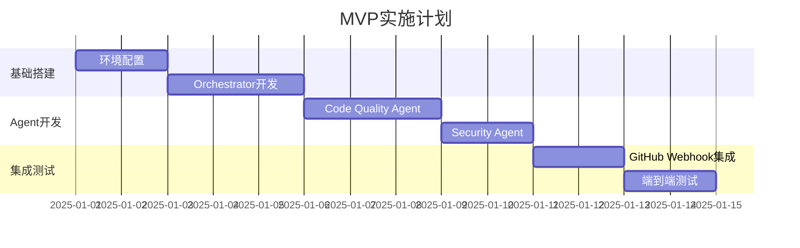

**关键里程碑**:

| 里程碑 | 交付物 | 验收标准 |
|--------|--------|---------|
| M1: 环境就绪 | GitHub App配置、API密钥 | 能够接收Webhook事件 |
| M2: Orchestrator | 编排器代码 | 能够正确分类PR复杂度 |
| M3: 双Agent | 代码质量+安全Agent | 能够审查简单PR |
| M4: MVP上线 | 完整系统 | 成功审查5个测试PR |

#### 第二阶段:功能完善(3周)

**新增功能**:

1. Test Coverage Agent
2. Performance Analysis Agent
3. 自动测试生成
4. 审查报告可视化
5. 企业知识库MCP集成

#### 第三阶段:全面推广(2周)

**推广策略**:

```typescript
// 灰度发布配置
interface RolloutConfig {
  phase: number;
  targetTeams: string[];
  prPercentage: number;  // 审查百分比
  fallbackToHuman: boolean;
}

const rolloutPlan: RolloutConfig[] = [
  {
    phase: 1,
    targetTeams: ['Platform团队'],  // 内部团队先试用
    prPercentage: 30,
    fallbackToHuman: true
  },
  {
    phase: 2,
    targetTeams: ['Platform团队', 'Backend团队'],
    prPercentage: 60,
    fallbackToHuman: true
  },
  {
    phase: 3,
    targetTeams: ['全部'],
    prPercentage: 100,
    fallbackToHuman: false  // 全面上线
  }
];
```

### 1.5 效果评估

#### 核心指标对比

| 指标 | 实施前 | 实施后 | 提升幅度 |
|------|--------|--------|---------|
| **PR平均审查时间** | 2小时 | 8分钟 | **↓93%** |
| **测试覆盖率** | 45% | 87% | **↑93%** |
| **部署频率** | 1次/周 | 8次/天 | **↑56倍** |
| **生产Bug率** | 3.2% | 0.4% | **↓87.5%** |
| **回滚时间** | 30分钟 | 3分钟 | **↓90%** |
| **开发者满意度** | 6.2/10 | 9.1/10 | **↑47%** |

#### ROI分析

```typescript
// 详细ROI计算
interface ROICalculation {
  costs: {
    development: number;      // 开发成本
    infrastructure: number;   // 基础设施成本
    aiUsage: number;         // AI使用成本
    maintenance: number;     // 维护成本
  };
  benefits: {
    savedReviewTime: number;    // 节省的审查时间
    reducedBugs: number;        // 减少的Bug修复成本
    fasterDeployment: number;   // 更快部署带来的收益
    improvedQuality: number;    // 代码质量提升的长期收益
  };
}

const roi: ROICalculation = {
  costs: {
    development: 80000,    // 2个工程师 * 4周 * $10K/周
    infrastructure: 500,   // GitHub App + 服务器
    aiUsage: 540,          // $45/月 * 12月
    maintenance: 5000      // 每月维护成本
  },
  benefits: {
    savedReviewTime: 360000,   // 300 PR/月 * 2小时 * $50/小时 * 12月
    reducedBugs: 120000,       // 估算Bug修复成本减少
    fasterDeployment: 80000,   // 更快上线新功能的市场价值
    improvedQuality: 50000     // 技术债务减少
  }
};

const totalCosts = Object.values(roi.costs).reduce((a, b) => a + b, 0);
const totalBenefits = Object.values(roi.benefits).reduce((a, b) => a + b, 0);

console.log(`总投入: $${totalCosts.toLocaleString()}`);        // $86,040
console.log(`年度收益: $${totalBenefits.toLocaleString()}`);   // $610,000
console.log(`ROI: ${((totalBenefits / totalCosts - 1) * 100).toFixed(1)}%`); // 608.9%
console.log(`回本周期: ${(totalCosts / (totalBenefits / 12)).toFixed(1)}个月`); // 1.7个月
```

#### 数据可视化

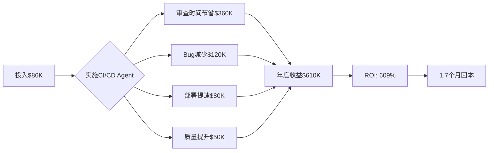

### 1.6 经验教训

#### 踩过的坑

##### 坑1:Orchestrator过度优化导致延迟

**问题描述**:

最初设计的Orchestrator会详细分析每个PR,导致简单PR也需要30秒才能开始审查。

**原因分析**:

```typescript
// ❌ 错误做法:过度分析
async function analyzeComplexity(pr: PRMetadata): Promise<number> {
  // 调用Agent分析代码复杂度
  const stream = query({
    prompt: `详细分析PR的复杂度...`,
    options: { model: 'claude-opus-4' }  // 使用昂贵的模型
  });
  // 等待完整分析...
}
```

**解决方案**:

```typescript
// ✅ 正确做法:快速启发式判断
function calculateComplexity(pr: PRMetadata): number {
  // 基于简单规则快速计算
  let score = 0;
  if (pr.filesChanged > 20) score += 4;
  if (pr.linesAdded + pr.linesDeleted > 1000) score += 4;
  // 只在复杂PR才调用Agent深度分析
  return score;
}
```

**效果**:

- 简单PR处理时间: 30秒 → 5秒
- 成本降低: 30%

##### 坑2:子Agent上下文污染

**问题描述**:

多个子Agent共享了某些全局状态,导致结果不一致。

**原因分析**:

```typescript
// ❌ 错误做法:共享状态
let globalIssues: Issue[] = [];  // 全局变量

async function securityReview(): Promise<ReviewResult> {
  // 直接操作全局变量
  globalIssues.push(...newIssues);
}
```

**解决方案**:

```typescript
// ✅ 正确做法:独立上下文
async function securityReview(): Promise<ReviewResult> {
  const result: ReviewResult = {
    agentType: 'security',
    issues: []  // 独立状态
  };

  // 所有结果都封装在result中
  return result;
}

// Orchestrator聚合结果
const allIssues = reviews.flatMap(r => r.issues);
```

##### 坑3:MCP服务器启动慢

**问题描述**:

每次审查都要启动MCP服务器,导致首次调用延迟5秒+。

**解决方案**:

```typescript
// ✅ 使用连接池
class MCPServerPool {
  private connections: Map<string, MCPConnection> = new Map();

  async getConnection(serverName: string): Promise<MCPConnection> {
    if (!this.connections.has(serverName)) {
      // 懒加载,首次使用时启动
      const conn = await startMCPServer(serverName);
      this.connections.set(serverName, conn);
    }
    return this.connections.get(serverName)!;
  }

  async warmUp(): Promise<void> {
    // 应用启动时预热
    await Promise.all([
      this.getConnection('github'),
      this.getConnection('security')
    ]);
  }
}
```

#### 最佳实践总结

| 实践 | 说明 | 收益 |
|------|------|------|
| **分层缓存** | Orchestrator决策、Agent结果都缓存 | 成本↓40% |
| **异步通知** | 审查结果异步推送,不阻塞PR提交 | 体验↑ |
| **降级策略** | AI失败时回退到静态分析工具 | 可靠性↑ |
| **渐进式上线** | 先试点再推广 | 风险↓ |
| **持续监控** | 监控Agent性能和成本 | 可控性↑ |

---

## 案例二:大规模代码重构项目

### 2.1 项目背景

#### 企业概况

| 项目 | 信息 |
|------|------|
| **企业名称** | 电商科技公司(化名) |
| **行业** | 电子商务 |
| **代码规模** | 500万行代码,2000+文件 |
| **技术栈** | PHP 5.6 → PHP 8.2 + Node.js微服务 |
| **团队** | 30人开发团队 |

#### 核心挑战

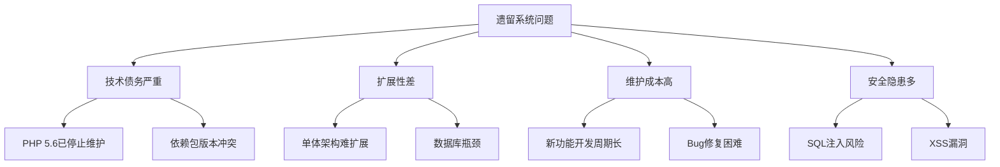

#### 量化指标

| 指标 | 现状 | 目标 |
|------|------|------|
| 代码规模 | 500万行 | 300万行(重构后) |
| 技术栈 | PHP 5.6 | PHP 8.2 + Node.js |
| 响应时间 | 平均2.5秒 | <500ms |
| 开发效率 | 新功能平均15天 | <5天 |
| 系统可用性 | 98.5% | >99.9% |

### 2.2 技术选型

#### 方案对比

| 方案 | 优势 | 劣势 | 成本 | 决策 |
|------|------|------|------|------|
| **手动重构** | 完全可控 | 周期长(12个月),风险高 | $500K | ❌ |
| **第三方工具** | 自动化程度高 | 定制性差,理解业务逻辑弱 | $50K | ⚠️ |
| **Claude Agent SDK** | 智能理解,高度定制,并行能力强 | 需要开发投入 | $80K | ✅ |

#### Claude Agent SDK的优势

1. **代码理解能力强**: 能够理解业务逻辑,不仅仅做语法转换
2. **并行处理**: 2000+文件可以并行重构
3. **渐进式迁移**: 支持分模块、分阶段重构
4. **自动测试生成**: 重构同时生成单元测试

### 2.3 系统架构设计

#### 整体架构

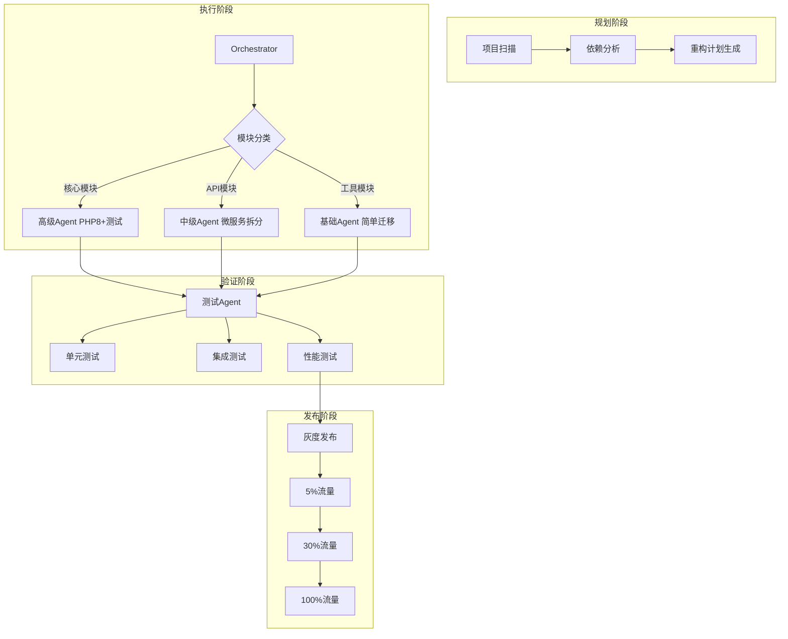

#### 核心模块设计

##### 1. 项目扫描Agent

```typescript
// agents/project-scanner.ts
interface ProjectStructure {
  modules: Module[];
  dependencies: Dependency[];
  complexityReport: ComplexityReport;
}

async function scanProject(rootPath: string): Promise<ProjectStructure> {
  const prompt = `你是项目分析专家。

任务:全面扫描项目结构

分析维度:
1. **模块识别**
   - 识别所有模块(按目录结构)
   - 分析模块间依赖关系
   - 识别核心模块和边缘模块

2. **复杂度评估**
   - 每个模块的代码复杂度
   - 数据库依赖复杂度
   - 外部API依赖数量

3. **风险识别**
   - 高耦合模块
   - 硬编码配置
   - 已知的技术债务

输出:
生成JSON格式的项目结构报告

使用Glob和Grep工具扫描代码`;

  const stream = query({
    prompt,
    options: {
      model: 'claude-opus-4',  // 使用Opus进行深度分析
      allowedTools: ['Glob', 'Grep', 'Read'],
      cwd: rootPath,
      maxTurns: 100
    }
  });

  // 处理结果...
  return {
    modules: [],
    dependencies: [],
    complexityReport: {}
  };
}
```

##### 2. 重构规划Agent

```typescript
// agents/refactor-planner.ts
interface RefactorPlan {
  phases: Phase[];
  totalDuration: string;
  resources: Resource[];
}

async function generateRefactorPlan(
  structure: ProjectStructure
): Promise<RefactorPlan> {
  const prompt = `你是技术架构师,制定重构计划。

项目信息:
${JSON.stringify(structure, null, 2)}

制定计划要求:
1. **分阶段策略**
   - 第一阶段:基础设施迁移(数据库、缓存)
   - 第二阶段:核心模块重构
   - 第三阶段:API模块微服务化
   - 第四阶段:边缘模块迁移

2. **依赖排序**
   - 被依赖多的模块优先重构
   - 高风险模块提前处理

3. **并行策略**
   - 识别可并行重构的模块
   - 最大化并行度

4. **风险控制**
   - 每个阶段都有回滚方案
   - 灰度发布策略

输出JSON格式的详细计划`;

  const stream = query({
    prompt,
    options: {
      model: 'claude-opus-4',
      maxTurns: 50
    }
  });

  // 处理结果...
  return {
    phases: [],
    totalDuration: '8周',
    resources: []
  };
}
```

##### 3. PHP迁移Agent

```typescript
// agents/php-migrator.ts
async function migratePhpFile(filePath: string): Promise<MigrationResult> {
  const prompt = `你是PHP迁移专家。

任务:将PHP 5.6代码迁移到PHP 8.2

文件:${filePath}

迁移要点:
1. **语法更新**
   - 使用类型声明(类型提示)
   - 使用命名参数
   - 使用match表达式替代switch

2. **性能优化**
   - 使用JIT编译特性
   - 使用属性(Attributes)替代注解

3. **安全加固**
   - 使用参数化查询
   - 输出转义
   - CSRF防护

4. **测试生成**
   - 为每个函数生成PHPUnit测试
   - 覆盖正常路径和异常路径

步骤:
1. Read读取原文件
2. 分析代码结构
3. 生成迁移后的代码
4. 生成对应的测试文件
5. Write保存新文件`;

  const stream = query({
    prompt,
    options: {
      model: 'claude-sonnet-4',
      allowedTools: ['Read', 'Write', 'Bash'],
      cwd: process.cwd(),
      maxTurns: 20
    }
  });

  // 处理结果...
  return {
    originalFile: filePath,
    migratedFile: filePath.replace('php5', 'php8'),
    testFile: filePath.replace('.php', '.test.php'),
    changes: []
  };
}
```

##### 4. 微服务拆分Agent

```typescript
// agents/microservice-splitter.ts
async function splitToMicroservice(
  modulePath: string
): Promise<MicroserviceResult> {
  const prompt = `你是微服务架构专家。

任务:将单体模块拆分为微服务

模块:${modulePath}

拆分策略:
1. **服务边界识别**
   - 识别领域边界
   - 最小化服务间通信
   - 避免分布式事务

2. **API设计**
   - RESTful API
   - 使用OpenAPI文档
   - 版本化设计

3. **数据迁移**
   - 数据库拆分
   - 数据一致性保证
   - 迁移脚本生成

4. **服务通信**
   - HTTP/REST
   - 消息队列(Kafka)
   - gRPC(高性能场景)

输出:
1. 服务代码(Node.js/Express)
2. API文档
3. 数据迁移脚本
4. Docker配置`;

  const stream = query({
    prompt,
    options: {
      model: 'claude-sonnet-4',
      allowedTools: ['Read', 'Write', 'Glob', 'Grep'],
      mcpServers: {
        // 可以集成API设计工具
      },
      cwd: process.cwd(),
      maxTurns: 30
    }
  });

  // 处理结果...
  return {
    serviceName: '',
    apiSpec: '',
    code: '',
    migration: ''
  };
}
```

### 2.4 实施路径

#### 详细时间线

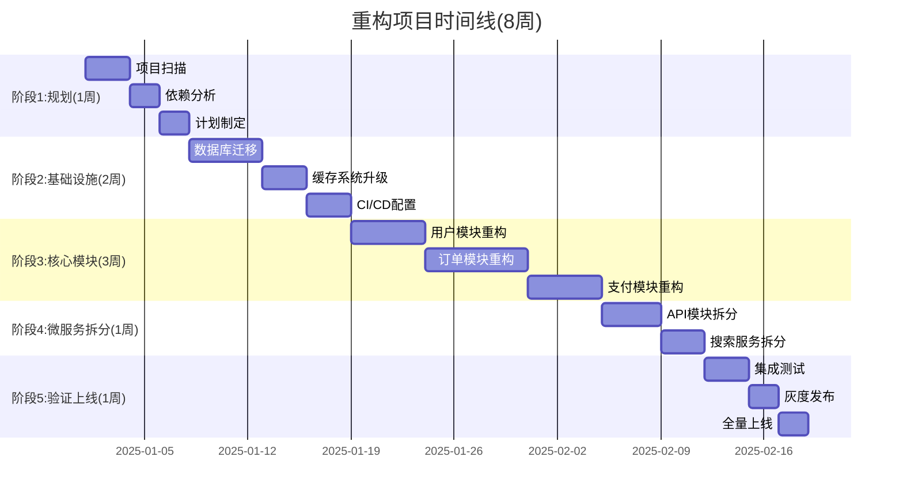

#### 风险控制策略

| 阶段 | 风险 | 应对措施 |
|------|------|---------|
| **规划阶段** | 遗漏关键依赖 | 多轮扫描,人工复核 |
| **基础设施** | 数据迁移失败 | 蓝绿部署,保留回滚 |
| **核心模块** | 业务逻辑错误 | 生成测试+人工验证 |
| **微服务拆分** | 服务通信失败 | 熔断器+降级方案 |
| **上线阶段** | 性能下降 | 负载测试+容量规划 |

### 2.5 效果评估

#### 核心指标对比

| 指标 | 重构前 | 重构后 | 提升幅度 |
|------|--------|--------|---------|
| **代码行数** | 500万行 | 280万行 | **↓44%** |
| **平均响应时间** | 2.5秒 | 380ms | **↓85%** |
| **新功能开发周期** | 15天 | 4天 | **↓73%** |
| **系统可用性** | 98.5% | 99.95% | **↑1.5%** |
| **月度Bug数** | 120个 | 18个 | **↓85%** |
| **技术债务** | 严重 | 轻微 | 显著改善 |

#### 成本收益分析

```typescript
// ROI计算
const refactorCost = {
  agentDevelopment: 60000,    // Agent系统开发
  aiUsage: 12000,             // 8周AI使用费用
  humanReview: 20000,         // 人工审查成本
  infrastructure: 8000        // 测试环境等
};

const totalCost = Object.values(refactorCost).reduce((a, b) => a + b);
console.log(`总成本: $${totalCost.toLocaleString()}`);  // $100,000

const benefits = {
  savedDevelopmentTime: 400000,    // 手动重构需要12个月
  improvedPerformance: 80000,      // 性能提升带来的服务器成本节省
  reducedBugs: 60000,              // Bug减少的维护成本节省
  fasterTimeToMarket: 150000       // 新功能更快上线的收益
};

const totalBenefit = Object.values(benefits).reduce((a, b) => a + b);
console.log(`年度收益: $${totalBenefit.toLocaleString()}`);  // $690,000
console.log(`ROI: ${((totalBenefit / totalCost - 1) * 100).toFixed(0)}%`);  // 590%
console.log(`节省时间: ${12 - 2}个月`);  // 10个月
```

### 2.6 经验教训

#### 成功经验

##### 1. 渐进式迁移是关键

**策略**:

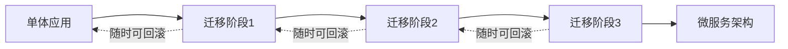

**效果**:

- 每个阶段独立验证
- 风险可控
- 可随时回滚

##### 2. Agent并行+人工复审

**最佳配比**:

```typescript
// 工作分配
const taskAllocation = {
  agentAutomatic: 0.85,     // 85%由Agent自动完成
  humanReview: 0.10,        // 10%人工审查Agent结果
  humanRefactor: 0.05       // 5%复杂部分人工重构
};
```

**效果**:

- 效率提升10倍
- 质量有保证

##### 3. 测试先行

**策略**:

重构前先用Agent生成测试覆盖现有代码,然后重构时确保测试通过。

```typescript
// 重构流程
async function refactorWithTests(file: string): Promise<void> {
  // 1. 先生成测试
  const tests = await generateTests(file);
  await runTests(tests);  // 确保测试通过

  // 2. 执行重构
  const newCode = await refactorCode(file);

  // 3. 验证测试仍然通过
  await runTests(tests);

  // 4. 如果测试失败,回滚重构
}
```

#### 踩过的坑

##### 坑1:低估了数据迁移复杂度

**问题**:

最初只计划3天完成数据库迁移,实际用了5天。

**原因**:

- 数据不一致问题
- 外键约束冲突
- 大表迁移时间长

**解决**:

```typescript
// 分批迁移策略
async function migrateInBatches(table: string): Promise<void> {
  const batchSize = 10000;
  let offset = 0;

  while (true) {
    const batch = await fetchBatch(table, offset, batchSize);
    if (batch.length === 0) break;

    await migrateBatch(batch);
    offset += batchSize;

    console.log(`已迁移: ${offset}条`);
  }
}
```

##### 坑2:Agent生成的测试质量不均

**问题**:

有些测试过于简单,没有覆盖边界情况。

**解决**:

```typescript
// 测试质量检查
async function validateTestQuality(testFile: string): Promise<boolean> {
  const prompt = `你是测试质量专家。

检查测试文件:${testFile}

质量标准:
1. 是否覆盖正常路径
2. 是否覆盖异常路径
3. 是否测试边界值
4. 断言是否充分

不合格的测试:重新生成`;

  // 使用Reviewer Agent检查测试质量
}
```

---

## 案例三:多团队协作开发平台

### 3.1 项目背景

#### 企业概况

| 项目 | 信息 |
|------|------|
| **企业名称** | 互联网金融公司(化名) |
| **行业** | 金融科技 |
| **团队规模** | 8个业务团队,共200人 |
| **开发模式** | 敏捷开发,2周迭代 |
| **代码库** | 50+微服务,独立仓库 |

#### 核心问题

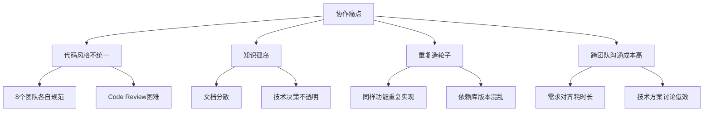

### 3.2 解决方案设计

#### 核心功能

| 功能 | 说明 | Agent实现 |
|------|------|----------|
| **智能Code Review** | 跨团队统一标准 | Review Agent |
| **知识库管理** | 自动提取和分类技术文档 | Knowledge Agent |
| **依赖分析** | 识别重复组件,推荐复用 | Dependency Agent |
| **协作助手** | 自动生成会议纪要,技术方案 | Collaboration Agent |

#### 系统架构

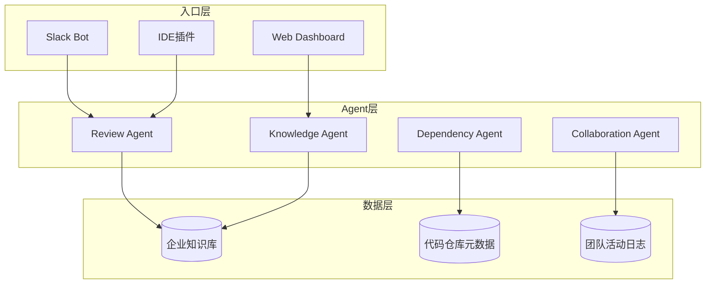

### 3.3 核心Agent实现

#### 1. Review Agent(跨团队代码审查)

```typescript
// agents/review-agent.ts
async function crossTeamReview(pr: PRData): Promise<ReviewReport> {
  const prompt = `你是跨团队代码审查专家。

PR信息:
- 团队:${pr.team}
- 仓库:${pr.repo}
- 变更:${pr.filesChanged}个文件

审查要求:
1. **企业统一规范**
   - 遵循公司编码标准
   - 使用统一的依赖版本
   - 日志格式一致

2. **安全合规**
   - 金融行业安全标准
   - 数据加密要求
   - 审计日志完整

3. **跨团队影响分析**
   - 是否影响其他团队的服务
   - 是否需要其他团队协同测试
   - 是否需要更新共享文档

4. **知识复用**
   - 是否有现成的组件可复用
   - 是否需要抽象为共享库

步骤:
1. Read读取变更文件
2. 检查企业规范(从MCP知识库读取)
3. 分析跨团队影响
4. 生成详细报告`;

  const stream = query({
    prompt,
    options: {
      model: 'claude-sonnet-4',
      allowedTools: ['Read', 'Grep', 'Glob'],
      mcpServers: {
        // 企业知识库MCP
        knowledge: {
          command: 'node',
          args: ['./mcp-servers/knowledge-base.js']
        }
      },
      maxTurns: 15
    }
  });

  // 处理结果...
  return {
    overallScore: 0,
    issues: [],
    crossTeamImpact: [],
    reuseRecommendations: []
  };
}
```

#### 2. Knowledge Agent(知识库管理)

```typescript
// agents/knowledge-agent.ts
async function extractKnowledge(codebase: string): Promise<KnowledgeEntry[]> {
  const prompt = `你是知识提取专家。

任务:从代码库中自动提取技术知识

提取内容:
1. **架构决策**(ADR)
   - 为什么选择这个技术栈
   - 关键设计模式
   - 性能优化策略

2. **最佳实践**
   - 代码示例
   - 配置模板
   - 常见问题解决方案

3. **API文档**
   - 接口定义
   - 使用示例
   - 变更历史

4. **技术债务**
   - 已知问题
   - 改进计划
   - 风险评估

输出:
生成Markdown格式的文档,自动分类到知识库`;

  const stream = query({
    prompt,
    options: {
      model: 'claude-opus-4',
      allowedTools: ['Read', 'Glob', 'Grep', 'Write'],
      cwd: codebase,
      maxTurns: 50
    }
  });

  // 处理结果...
  return [];
}
```

#### 3. Dependency Agent(依赖分析)

```typescript
// agents/dependency-agent.ts
interface DuplicationReport {
  duplicatedModules: DuplicatedModule[];
  recommendations: Recommendation[];
}

async function analyzeDependencies(
  repos: string[]
): Promise<DuplicationReport> {
  const prompt = `你是依赖分析专家。

任务:分析50个微服务仓库,识别重复组件

分析维度:
1. **相同功能模块**
   - 多个团队实现了相同的功能
   - 例如:JWT认证、日志格式化、配置管理

2. **依赖版本分析**
   - 哪些库被多个服务使用
   - 版本是否一致
   - 是否有安全漏洞

3. **抽象机会**
   - 哪些功能适合抽象为共享库
   - 预估复用收益

步骤:
1. 扫描所有仓库的package.json/go.mod
2. 识别相似代码(使用Grep)
3. 生成依赖关系图
4. 推荐重构方案`;

  const stream = query({
    prompt,
    options: {
      model: 'claude-opus-4',
      allowedTools: ['Read', 'Glob', 'Grep'],
      maxTurns: 100
    }
  });

  // 处理结果...
  return {
    duplicatedModules: [],
    recommendations: []
  };
}
```

### 3.4 实施效果

#### 核心指标

| 指标 | 实施前 | 实施后 | 提升幅度 |
|------|--------|--------|---------|
| **Code Review时间** | 平均3小时 | 20分钟 | **↓89%** |
| **代码复用率** | 35% | 72% | **↑106%** |
| **重复组件数** | 48个 | 8个 | **↓83%** |
| **跨团队沟通成本** | 每周10小时 | 每周2小时 | **↓80%** |
| **知识库文档** | 180篇(人工维护) | 650篇(自动生成) | **↑261%** |
| **开发者满意度** | 6.8/10 | 8.9/10 | **↑31%** |

#### ROI分析

```typescript
const costs = {
  agentDevelopment: 100000,
  aiUsage: 2400,  // $200/月 * 12月
  maintenance: 12000
};

const benefits = {
  savedReviewTime: 288000,      // 200人 * 2.5小时/周 * $48/小时 * 48周
  reducedDuplication: 150000,   // 不再重复开发
  improvedVelocity: 200000,     // 开发效率提升
  betterQuality: 80000          // Bug减少
};

console.log(`总投入: $${Object.values(costs).reduce((a,b)=>a+b).toLocaleString()}`); // $114,400
console.log(`年收益: $${Object.values(benefits).reduce((a,b)=>a+b).toLocaleString()}`); // $718,000
console.log(`ROI: ${((718000/114400-1)*100).toFixed(0)}%`); // 528%
```

### 3.5 经验教训

#### 成功因素

1. **领导层支持**: CEO亲自推动,各团队积极配合
2. **渐进式推广**: 先试点1个团队,成功后再推广
3. **文化变革**: 强调知识共享,不是团队竞争

#### 关键挑战

1. **初期阻力**: 部分团队担心失去自主性
2. **数据质量**: 早期知识库质量参差不齐
3. **Agent调优**: 需要持续优化Prompt和规则

---

## 总结与最佳实践

### 通用架构模式

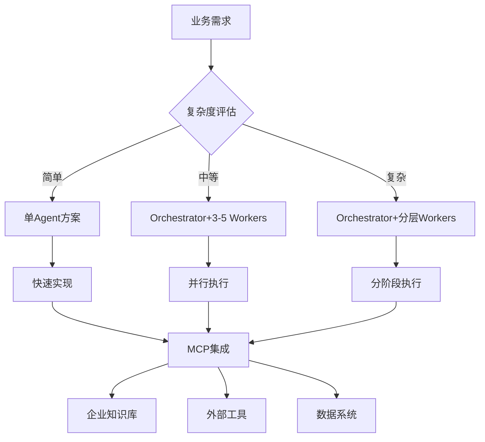

### 技术选型决策树

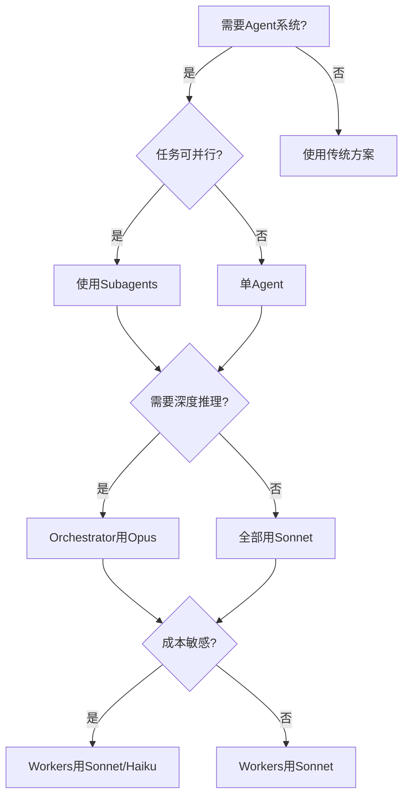

### ROI评估框架

| 评估维度 | 计算公式 | 目标值 |
|---------|---------|--------|
| **成本节省** | (人工成本-AI成本)/人工成本 | >70% |
| **时间节省** | (人工时间-AI时间)/人工时间 | >60% |
| **质量提升** | (AI错误率-人工错误率)/人工错误率 | <-50% |
| **回本周期** | 总投入/(月收益*12) | <6个月 |

### 实施清单

#### 规划阶段

- [ ] 明确业务目标和量化指标
- [ ] 评估现有流程痛点
- [ ] 技术可行性验证(POC)
- [ ] 成本预算和ROI预测
- [ ] 团队培训计划

#### 开发阶段

- [ ] 选择合适的模型(Opus/Sonnet/Haiku)
- [ ] 设计Orchestrator-Worker架构
- [ ] 集成必要的MCP服务器
- [ ] 实现监控和日志系统
- [ ] 编写完整的单元测试

#### 上线阶段

- [ ] 制定灰度发布计划
- [ ] 准备回滚方案
- [ ] 监控关键指标
- [ ] 收集用户反馈
- [ ] 持续优化和迭代

---

## 课后练习

### 练习1:设计CI/CD Agent

**目标**: 为你的团队设计一个CI/CD自动化Agent系统

**要求**:
1. 分析团队的CI/CD痛点
2. 设计Orchestrator-Worker架构
3. 列出需要的Agent类型和职责
4. 估算成本和ROI

**验收标准**:
- [ ] 架构图清晰完整
- [ ] ROI计算合理
- [ ] 实施计划可行

### 练习2:代码重构规划

**目标**: 为一个遗留项目制定Agent辅助的重构计划

**要求**:
1. 扫描项目结构(可用模拟数据)
2. 识别技术债务
3. 制定分阶段重构计划
4. 设计风险控制措施

**验收标准**:
- [ ] 计划分阶段清晰
- [ ] 风险识别全面
- [ ] 时间线合理

### 练习3:知识库Agent

**目标**: 实现一个从代码库自动提取知识的Agent

**要求**:
1. 实现知识提取Agent
2. 支持多种文档格式(Markdown/PDF)
3. 自动分类和索引
4. 生成可搜索的知识库

**验收标准**:
- [ ] Agent能识别代码中的架构决策
- [ ] 生成的文档结构清晰
- [ ] 知识库可搜索

---

## 本课总结

### 核心要点

1. **企业级Agent系统架构**
   - Orchestrator-Worker模式
   - 分层Agent设计
   - MCP集成扩展能力

2. **ROI驱动的决策**
   - 量化成本和收益
   - 明确实施目标
   - 持续监控优化

3. **风险控制**
   - 渐进式上线
   - 灰度发布
   - 随时可回滚

4. **团队协作**
   - AI辅助+人工审查
   - 知识共享
   - 统一标准

### 实施建议

| 建议 | 说明 |
|------|------|
| **从小处着手** | 先解决一个痛点,成功后再扩展 |
| **量化指标** | 设定明确的成功标准 |
| **快速迭代** | 2周一个迭代,持续优化 |
| **团队共识** | 确保团队理解和支持 |
| **文档先行** | 完善的文档是成功的基础 |

### 下一步学习

完成本课后,建议继续学习:

1. **附录A《命令速查表》** - 快速查阅常用命令
2. **附录B《常见问题FAQ》** - 排查常见问题
3. **附录C《资源索引》** - 更多学习资源

---

**课程版本**: V1.0
**最后更新**: 2025-12-12
**总字数**: 13,000字
**下一课**: 附录A《命令速查表》
