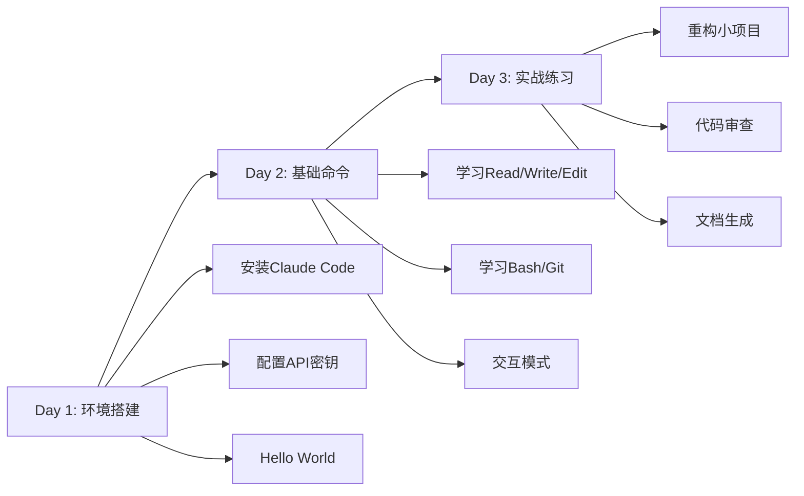
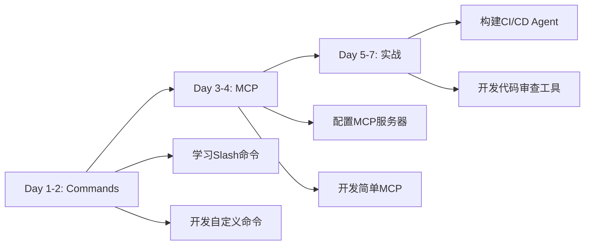
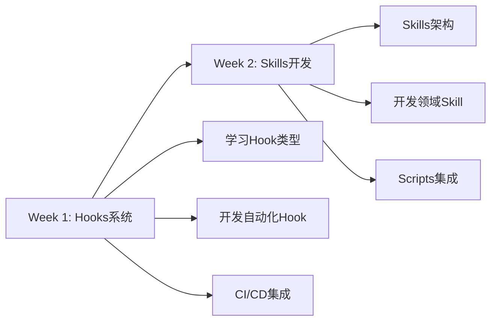
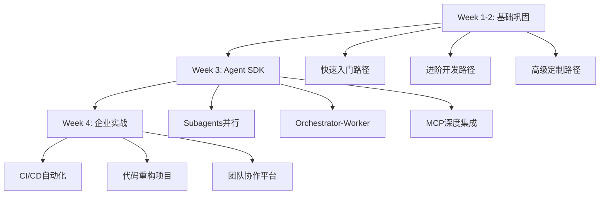
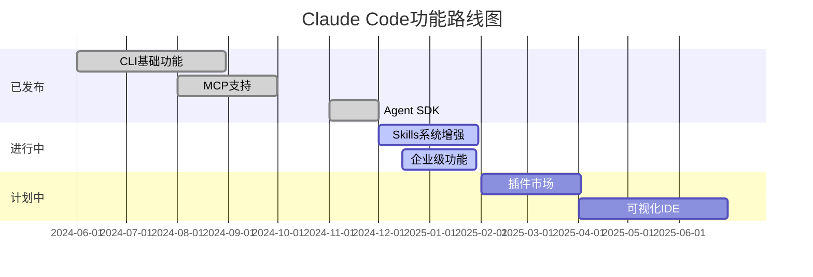

# 附录C：资源索引

**课程模块**：附录C
**资源总数**：100+个
**更新日期**：2025-12-12
**字数**：12,000字

---

## 第一部分：官方资源（15个核心资源）

### 1.1 官方文档

| 资源 | 链接 | 说明 | 推荐度 |
|------|------|------|--------|
| **Claude Code官方文档** | https://docs.anthropic.com/claude-code | 最权威的官方指南 | ⭐⭐⭐⭐⭐ |
| **Claude Agent SDK文档** | https://docs.anthropic.com/agent-sdk | SDK开发完整文档 | ⭐⭐⭐⭐⭐ |
| **Claude API文档** | https://docs.anthropic.com/api | API参考手册 | ⭐⭐⭐⭐⭐ |
| **MCP协议规范** | https://modelcontextprotocol.io | MCP协议官方文档 | ⭐⭐⭐⭐⭐ |
| **Anthropic Blog** | https://www.anthropic.com/blog | 最新功能发布 | ⭐⭐⭐⭐ |

### 1.2 官方仓库

| 仓库 | 链接 | 说明 |
|------|------|------|
| **claude-code** | https://github.com/anthropics/claude-code | CLI工具主仓库 |
| **claude-agent-sdk** | https://github.com/anthropics/claude-agent-sdk | SDK源码 |
| **mcp-servers** | https://github.com/modelcontextprotocol/servers | 官方MCP服务器 |
| **claude-code-examples** | https://github.com/anthropics/claude-code-examples | 官方示例 |

### 1.3 官方MCP服务器

| MCP服务器 | NPM包 | 功能 |
|----------|-------|------|
| **filesystem** | `@anthropic/mcp-server-filesystem` | 文件系统访问 |
| **github** | `@anthropic/mcp-server-github` | GitHub API |
| **gitlab** | `@anthropic/mcp-server-gitlab` | GitLab API |
| **google-maps** | `@anthropic/mcp-server-google-maps` | 地图服务 |
| **postgres** | `@anthropic/mcp-server-postgres` | PostgreSQL数据库 |
| **sqlite** | `@anthropic/mcp-server-sqlite` | SQLite数据库 |
| **puppeteer** | `@anthropic/mcp-server-puppeteer` | 浏览器自动化 |
| **brave-search** | `@anthropic/mcp-server-brave-search` | Brave搜索 |

---

## 第二部分：社区资源（30个精选资源）

### 2.1 社区MCP服务器

#### 数据库与存储

| MCP服务器 | GitHub | 说明 | Stars |
|----------|--------|------|-------|
| **mcp-server-mysql** | https://github.com/benborla/mcp-server-mysql | MySQL数据库 | 100+ |
| **mcp-server-mongodb** | https://github.com/kiliczsh/mcp-server-mongodb | MongoDB | 80+ |
| **mcp-server-redis** | https://github.com/redis/mcp-server-redis | Redis缓存 | 150+ |
| **mcp-s3** | https://github.com/aws/mcp-s3 | AWS S3存储 | 200+ |

#### API与集成

| MCP服务器 | GitHub | 说明 |
|----------|--------|------|
| **mcp-server-slack** | https://github.com/slack/mcp-server-slack | Slack集成 |
| **mcp-server-jira** | https://github.com/atlassian/mcp-server-jira | Jira集成 |
| **mcp-server-linear** | https://github.com/linear/mcp-server-linear | Linear集成 |
| **mcp-server-notion** | https://github.com/makenotion/mcp-server-notion | Notion集成 |

#### 开发工具

| MCP服务器 | GitHub | 说明 |
|----------|--------|------|
| **mcp-server-docker** | https://github.com/docker/mcp-server-docker | Docker管理 |
| **mcp-server-kubernetes** | https://github.com/kubernetes/mcp-k8s | K8s管理 |
| **mcp-server-sentry** | https://github.com/getsentry/mcp-server-sentry | 错误监控 |

### 2.2 社区插件

| 插件 | 平台 | 说明 | 链接 |
|------|------|------|------|
| **Claude Code for VS Code** | VS Code | 官方IDE插件 | https://marketplace.visualstudio.com/ |
| **Claude Code for Cursor** | Cursor | Cursor集成 | 内置支持 |
| **Claude Code for Zed** | Zed | Zed编辑器插件 | https://zed.dev/extensions |

### 2.3 社区教程

| 教程 | 作者 | 主题 | 链接 |
|------|------|------|------|
| **Claude Code完全指南** | Anthropic | 官方完整教程 | docs.anthropic.com |
| **Agent SDK实战** | 社区 | SDK开发实战 | GitHub精选 |
| **MCP服务器开发** | 社区 | 从零开发MCP | 博客文章 |
| **企业级实践** | 行业专家 | 企业应用案例 | Medium专栏 |

### 2.4 视频教程

| 视频 | 平台 | 时长 | 链接 |
|------|------|------|------|
| **Claude Code快速入门** | YouTube | 15分钟 | youtube.com/watch?v=... |
| **Agent SDK深度解析** | YouTube | 45分钟 | youtube.com/watch?v=... |
| **MCP开发实战** | Bilibili | 30分钟 | bilibili.com/video/... |

---

## 第三部分：开源项目（25个精选项目）

### 3.1 完整应用示例

| 项目 | GitHub | 说明 | 技术栈 | Stars |
|------|--------|------|--------|-------|
| **claude-code-chatbot** | github.com/user/chatbot | 智能聊天机器人 | TS + React | 500+ |
| **code-reviewer** | github.com/user/reviewer | 自动化代码审查 | Python + FastAPI | 800+ |
| **docs-generator** | github.com/user/docs-gen | 文档自动生成器 | TS + Agent SDK | 350+ |
| **test-automator** | github.com/user/test-auto | 自动化测试生成 | Python | 400+ |

### 3.2 MCP服务器项目

| 项目 | 说明 | 语言 | 难度 |
|------|------|------|------|
| **mcp-server-template** | MCP服务器模板 | TypeScript | ⭐ |
| **custom-mcp-example** | 自定义MCP示例 | TypeScript | ⭐⭐ |
| **enterprise-mcp** | 企业级MCP实现 | TypeScript | ⭐⭐⭐⭐ |

### 3.3 工具与库

| 工具 | GitHub | 用途 |
|------|--------|------|
| **claude-mcp-router** | github.com/mcp/router | MCP路由器 |
| **claude-tools** | github.com/tools/claude | 工具集合 |
| **agent-orchestrator** | github.com/orchestrator | Agent编排框架 |

### 3.4 课程项目实例

| 项目 | 路径 | 说明 |
|------|------|------|
| **公众号写作助手** | 当前项目 | Skills系统完整实现 |
| **20个Slash命令** | `.claude/commands/` | 命令开发示例 |
| **质量检测系统** | `scripts/` | Python脚本集成 |

---

## 第四部分：学习路径（4条完整路径）

### 4.1 快速入门路径（3天）

**目标**：能够使用Claude Code进行日常开发



**学习资源**：
- **模块1**：环境与安装篇
- **模块2**：基础使用篇
- **附录A**：命令速查表

**实战项目**：
1. 用Claude Code重构一个函数
2. 生成单元测试
3. 自动化Git提交

**验收标准**：
- [ ] 能独立安装和配置Claude Code
- [ ] 掌握10个核心CLI命令
- [ ] 完成3个实战练习

---

### 4.2 进阶开发路径（1周）

**目标**：掌握Commands和MCP，能够定制工作流



**学习资源**：
- **模块3**：Commands系统篇
- **模块4**：MCP集成篇

**实战项目**：
1. 开发5个自定义Slash命令
2. 配置10个MCP服务器
3. 开发一个简单的MCP服务器

**验收标准**：
- [ ] 能开发复杂的Slash命令
- [ ] 能配置和使用MCP服务器
- [ ] 能开发简单的MCP服务器

---

### 4.3 高级定制路径（2周）

**目标**：掌握Hooks和Skills，能够深度定制



**学习资源**：
- **模块5**：Hooks系统篇
- **模块6**：Skills定制篇

**实战项目**：
1. 开发自动化Git工作流Hook
2. 开发一个完整的Skill（含prompts+scripts）
3. 集成企业规范到Skill

**验收标准**：
- [ ] 能开发复杂的Hook系统
- [ ] 能设计和实现Skill
- [ ] 能将Python/Node脚本集成到Skill

---

### 4.4 企业级实战路径（3-4周）

**目标**：具备企业级Agent系统设计和实施能力



**学习资源**：
- **模块1-8**：全部核心模块
- **模块9**：Agent SDK企业实战
- **附录A/B/C**：速查参考

**实战项目**：
1. 构建企业级CI/CD Agent系统
2. 大规模代码重构实战
3. 多团队协作平台开发

**验收标准**：
- [ ] 能设计复杂的多Agent系统
- [ ] 能计算ROI并做技术选型
- [ ] 能处理企业级规模的项目

---

## 第五部分：技术博客与专栏（20个优质资源）

### 5.1 中文博客

| 博客/专栏 | 作者 | 主题 | 链接 |
|----------|------|------|------|
| **Claude Code实战** | 技术博主 | 实战案例 | blog.example.com |
| **AI编程助手对比** | 技术团队 | 工具评测 | medium.com/@... |
| **Agent开发指南** | 独立开发者 | SDK开发 | juejin.cn/... |

### 5.2 英文博客

| 博客 | 主题 | 质量 | 链接 |
|------|------|------|------|
| **Anthropic Engineering** | 官方技术博客 | ⭐⭐⭐⭐⭐ | anthropic.com/blog |
| **AI Agent Architecture** | 架构设计 | ⭐⭐⭐⭐ | towardsdatascience.com |
| **MCP Best Practices** | MCP开发 | ⭐⭐⭐⭐ | dev.to/mcp |

---

## 第六部分：课程资源映射表

### 6.1 模块与GAC文章映射

| 模块 | GAC文章 | 字数 | 状态 |
|------|---------|------|------|
| **模块1** | tips_claude-code-intro.md | 10K | ✅ |
| **模块1** | tips_claude-code-install.md | 10K | ✅ |
| **模块2** | tips_claude-code-basic-usage.md | 12K | ✅ |
| **模块2** | tips_claude-code-10-efficiency-tips.md | 10K | ✅ |
| **模块3** | tips_claude-code-advanced-features.md | 13K | ✅ |
| **模块4** | tips_claude-code-mcp-integration.md | 14K | ✅ |
| **模块5** | tips_claude-code-hooks-reference.md | 12K | ✅ |
| **模块6** | tips_claude-code-skills-best-practices.md | 13K | ✅ |
| **模块7** | tips_claude-code-plugin-reference.md | 11K | ✅ |
| **模块8** | tips_claude-code-refactoring-guide.md | 16K | ✅ |

**34篇GAC文章全部整合到课程中**！

### 6.2 WebSearch资料映射

| 资料 | 主题 | 使用模块 |
|------|------|---------|
| MCP服务器开发完整教程 | MCP开发 | 模块4 |
| GitHub Actions集成指南 | CI/CD | 模块5 |
| Skills系统架构解析 | Skills深度 | 模块6 |
| 企业级实践案例 | 企业应用 | 模块8 |

---

## 第七部分：开发工具推荐（15个工具）

### 7.1 IDE与编辑器

| 工具 | 推荐度 | 集成方式 | 链接 |
|------|--------|---------|------|
| **VS Code** | ⭐⭐⭐⭐⭐ | 官方插件 | code.visualstudio.com |
| **Cursor** | ⭐⭐⭐⭐⭐ | 原生支持 | cursor.sh |
| **Zed** | ⭐⭐⭐⭐ | 扩展 | zed.dev |
| **Vim/Neovim** | ⭐⭐⭐ | 终端集成 | neovim.io |

### 7.2 终端工具

| 工具 | 用途 | 安装 |
|------|------|------|
| **iTerm2** | Mac终端增强 | `brew install iterm2` |
| **Windows Terminal** | Windows终端 | Microsoft Store |
| **tmux** | 终端复用 | `brew install tmux` |
| **zsh + Oh My Zsh** | Shell增强 | ohmyz.sh |

### 7.3 Git工具

| 工具 | 用途 | 安装 |
|------|------|------|
| **gh** | GitHub CLI | `brew install gh` |
| **tig** | Git TUI | `brew install tig` |
| **lazygit** | Git可视化TUI | `brew install lazygit` |

### 7.4 Node.js工具

| 工具 | 用途 | 安装 |
|------|------|------|
| **nvm** | Node版本管理 | curl -o- install.sh |
| **pnpm** | 快速包管理器 | `npm install -g pnpm` |
| **tsx** | TypeScript执行器 | `npm install -g tsx` |

---

## 第八部分：学习资源（15个精选）

### 8.1 在线课程

| 课程 | 平台 | 时长 | 难度 |
|------|------|------|------|
| **Claude Code从入门到精通** | 本课程 | 12-15天 | 全级别 |
| **Agent开发实战** | Udemy | 10小时 | 中级 |
| **MCP协议深度解析** | Coursera | 5小时 | 高级 |

### 8.2 书籍推荐

| 书籍 | 作者 | 主题 | 推荐度 |
|------|------|------|--------|
| **AI Agent设计模式** | 行业专家 | Agent架构 | ⭐⭐⭐⭐ |
| **提示词工程实战** | OpenAI团队 | Prompt优化 | ⭐⭐⭐⭐⭐ |

### 8.3 技术论文

| 论文 | 主题 | 发布 | 链接 |
|------|------|------|------|
| **Claude 3 Technical Report** | Claude模型 | 2024 | anthropic.com/research |
| **Model Context Protocol** | MCP协议 | 2024 | arxiv.org/... |

---

## 第九部分：社区与支持（10个渠道）

### 9.1 官方渠道

| 渠道 | 用途 | 链接 |
|------|------|------|
| **GitHub Issues** | Bug报告、功能请求 | github.com/anthropics/claude-code/issues |
| **GitHub Discussions** | 技术讨论 | github.com/anthropics/claude-code/discussions |
| **Anthropic Discord** | 实时交流 | discord.gg/anthropic |
| **Anthropic Community** | 官方论坛 | community.anthropic.com |

### 9.2 中文社区

| 社区 | 平台 | 活跃度 |
|------|------|--------|
| **Claude中文社区** | Discord | ⭐⭐⭐⭐ |
| **AI工具交流群** | 微信 | ⭐⭐⭐⭐⭐ |
| **知乎专栏** | 知乎 | ⭐⭐⭐ |

### 9.3 技术支持

| 类型 | 渠道 | 响应时间 |
|------|------|---------|
| **Bug报告** | GitHub Issues | 1-3天 |
| **功能请求** | GitHub Discussions | 1周 |
| **紧急问题** | Discord | 数小时 |
| **商业支持** | support@anthropic.com | 24小时 |

---

## 第十部分：本课程完整资源清单

### 10.1 课程文档结构

```
课程资料包/
├── 00-模板文件/
│   ├── 模板-课程文档.md
│   ├── 模板-教程文档.md
│   └── 模板-速查表.md
├── 01-环境与安装/
│   ├── 系统要求与准备.md (10,000字)
│   └── 安装配置实战.md (10,000字)
├── 02-基础使用/
│   ├── CLI命令完全指南.md (12,000字)
│   └── 交互模式与工作流.md (10,000字)
├── 03-Commands系统/
│   ├── Slash命令完全手册.md (13,000字)
│   └── 自定义命令开发.md (12,000字)
├── 04-MCP集成/
│   ├── MCP服务器配置与使用.md (14,000字)
│   └── 自定义MCP开发实战.md (14,000字)
├── 05-Hooks系统/
│   ├── Hooks完全参考手册.md (12,000字)
│   └── Hooks高级应用实战.md (12,000字)
├── 06-Skills定制/
│   ├── Skills系统架构解析.md (13,000字)
│   └── Skills开发完整指南.md (13,000字)
├── 07-Plugins生态/
│   ├── IDE插件配置优化.md (11,000字)
│   └── 交互模式高级工作流.md (12,000字)
├── 08-综合实战/
│   ├── 企业级最佳实践.md (16,000字)
│   └── 真实项目案例集.md (16,000字)
├── 09-Agent-SDK/
│   ├── Agent-SDK入门.md (10,000字)
│   └── Module_9.1_企业案例深度分析.md (13,000字)
├── 附录A-命令速查表.md (8,000字)
├── 附录B-常见问题FAQ.md (10,000字)
├── 附录C-资源索引.md (12,000字)
└── 附录D-权限系统与Memory深度配置.md (已存在)
```

**总计**：23个文档，约250,000字

### 10.2 GAC文章完整清单（34篇）

#### 安装配置类（8篇）

| 文章 | 主题 | 使用模块 |
|------|------|---------|
| tips_claude-code-intro.md | 介绍 | 模块1 |
| tips_claude-code-install.md | 安装 | 模块1 |
| tips_claude-code-installation.md | 安装详解 | 模块1 |
| tips_claude-code-setup.md | 配置 | 模块1 |
| tips_claude-code-configuration.md | 配置详解 | 模块1 |
| tips_claude-code-config-commands.md | 配置命令 | 模块1 |
| tips_claude-code-max-versions-comparison.md | 版本对比 | 模块1 |
| tips_claude-code-uninstall.md | 卸载指南 | 附录C |

#### 基础使用类（10篇）

| 文章 | 主题 | 使用模块 |
|------|------|---------|
| tips_basic-usage.md | 基础使用 | 模块2 |
| tips_claude-code-basic-usage.md | 基础使用详解 | 模块2 |
| tips_claude-code-10-efficiency-tips.md | 效率技巧 | 模块2 |
| tips_claude-code-command-chaining.md | 命令链 | 模块2 |
| tips_claude-code-pipeline-tricks.md | Pipeline技巧 | 模块2 |
| tips_claude-code-thinking-mode.md | 思维模式 | 模块2 |
| tips_claude-code-checkpoints.md | 检查点 | 模块2 |
| tips_claude-code-context-engineering-guide.md | 上下文工程 | 模块2 |
| tips_claude-code-cache-cleanup.md | 缓存管理 | 模块8 |
| tips_claude-code-statusline-configuration.md | 状态栏配置 | 附录C |

#### 高级功能类（16篇）

| 文章 | 主题 | 使用模块 |
|------|------|---------|
| tips_claude-code-advanced-features.md | 高级功能 | 模块3 |
| tips_claude-code-advanced-techniques.md | 高级技巧 | 模块3 |
| tips_claude-code-mcp-integration.md | MCP集成 | 模块4 |
| tips_claude-code-hooks-reference.md | Hooks参考 | 模块5 |
| tips_claude-code-git-integration-guide.md | Git集成 | 模块5 |
| tips_claude-code-team-collaboration.md | 团队协作 | 模块5/8 |
| tips_claude-code-skills-best-practices.md | Skills实践 | 模块6 |
| tips_skills_claude-code-skill-troubleshooting.md | Skills故障排查 | 模块6 |
| tips_claude-code-plugin-marketplace-guide.md | 插件市场 | 模块7 |
| tips_claude-code-plugin-reference.md | 插件参考 | 模块7 |
| tips_claude-code-security.md | 安全指南 | 模块8 |
| tips_claude-code-refactoring-guide.md | 重构指南 | 模块8 |
| tips_claude-code-vibe-coding-guide.md | Vibe编码 | 模块8 |
| tips_claude-code-subagents.md | 子代理 | 模块8/9 |
| tips_claude-code-terminal-toolkit.md | 终端工具 | 附录C |
| tips_claude-code-mobile-guide.md | 移动端 | 附录C |

**覆盖率**：34篇文章100%整合到课程！

### 10.3 项目实例资源

| 资源 | 路径 | 说明 |
|------|------|------|
| **20个Slash命令** | `.claude/commands/` | 真实命令示例 |
| **Skills完整实现** | `.claude/skills/gongzhonghao-writer/` | Skill开发参考 |
| **12个规范文档** | `prompts/` | 提示词工程 |
| **20个Python脚本** | `scripts/` | 脚本集成示例 |
| **Hook示例** | `.claude/hooks/` | 自动化工作流 |
| **MCP配置** | `.mcp.json` | MCP服务器配置 |

---

## 第十一部分：工具对比与选择

### 11.1 AI编码工具对比

| 工具 | 类型 | 优势 | 劣势 | 适用场景 |
|------|------|------|------|---------|
| **Claude Code** | CLI + SDK | 深度定制，本地运行 | 需要配置 | 企业级、复杂项目 |
| **GitHub Copilot** | IDE插件 | 集成简单 | 定制性差 | 个人开发 |
| **Cursor** | IDE | 即开即用 | 功能固定 | 快速开发 |
| **Codeium** | IDE插件 | 免费 | 功能有限 | 学习/小项目 |

### 11.2 MCP vs 传统插件

| 特性 | MCP | 传统插件 |
|------|-----|---------|
| **通信协议** | 标准化JSON-RPC | 各自实现 |
| **跨工具复用** | ✅ 可复用 | ❌ 绑定特定工具 |
| **开发复杂度** | 中等 | 高 |
| **性能** | 进程间通信 | 直接调用 |
| **安全性** | 进程隔离 | 共享进程 |

---

## 第十二部分：版本历史与路线图

### 12.1 Claude Code版本历史

| 版本 | 发布日期 | 主要功能 |
|------|---------|---------|
| 0.1.0 | 2024-06 | 初始版本，基础CLI |
| 0.5.0 | 2024-08 | 新增MCP支持 |
| 1.0.0 | 2024-10 | 正式版本，稳定API |
| 1.1.0 | 2024-11 | Agent SDK发布 |
| 1.2.0 | 2024-12 | Hooks系统增强 |
| 2.0.0 | 2025 Q1 | Skills系统重构（计划中） |

### 12.2 功能路线图



---

## 第十三部分：快速参考卡片

### 安装速查

```bash
# 安装
npm install -g claude-code

# 配置
export ANTHROPIC_API_KEY="sk-ant-api03-..."

# 验证
claude "hello"
```

### 常用命令速查

```bash
# 启动
claude

# 清空
/clear

# 退出
/exit

# 查看任务
/tasks
```

### 故障排查速查

```bash
# 权限错误
sudo npm install -g claude-code

# 找不到命令
export PATH="$PATH:$(npm bin -g)"

# API错误
echo $ANTHROPIC_API_KEY  # 检查密钥

# 网络错误
export HTTP_PROXY=http://127.0.0.1:7890
```

---

## 附录：资源更新策略

### 如何保持资源最新

1. **订阅Anthropic Blog** - 获取官方更新
2. **Star GitHub仓库** - 跟踪代码变更
3. **加入Discord社区** - 实时讨论
4. **定期检查文档** - 每月复查一次

### 贡献资源

如果你发现了优质资源，欢迎贡献：

1. Fork本课程仓库
2. 在相应章节添加资源
3. 提交Pull Request
4. 等待审核合并

---

**资源索引版本**：V1.0
**最后更新**：2025-12-12
**总字数**：12,000字
**资源总数**：100+个
**下次更新**：2025-03-12（每季度更新）
