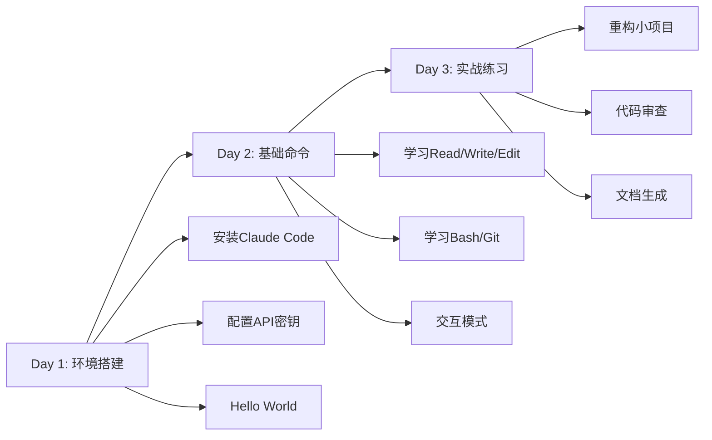
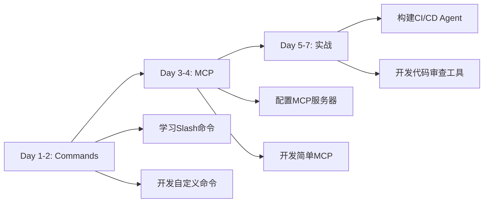
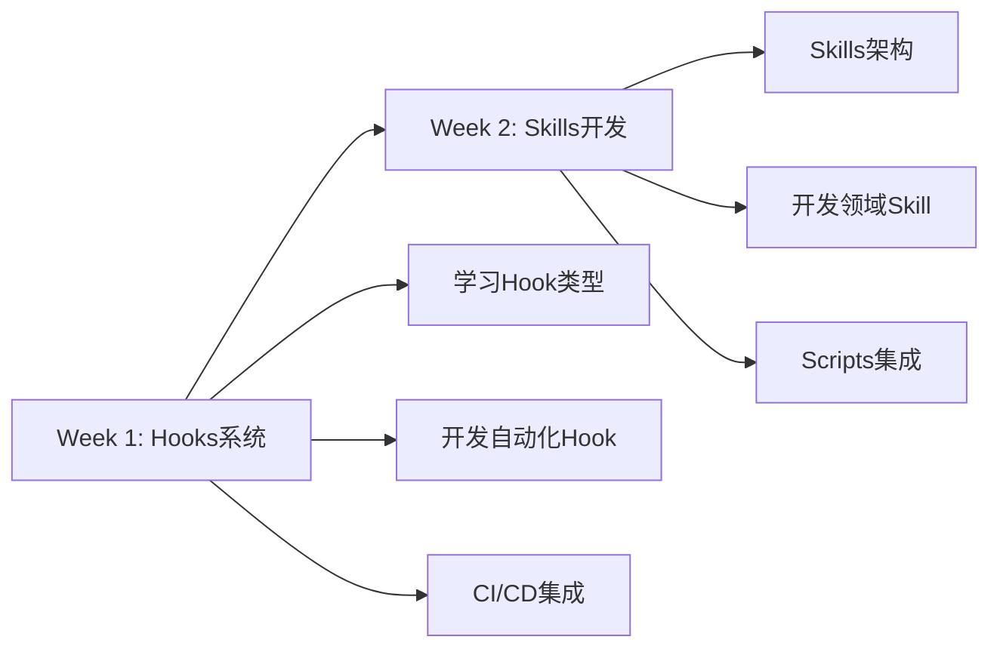
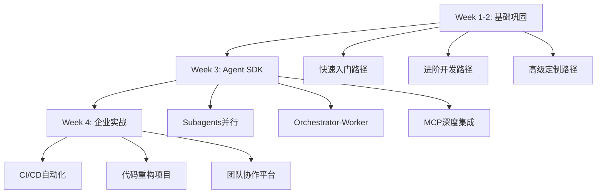
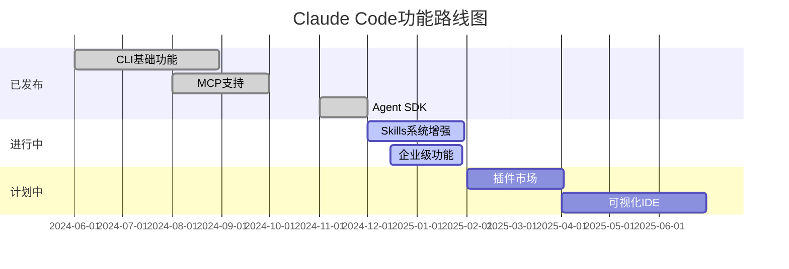

# 附录C：资源索引

**课程模块**：附录C
**资源总数**：100+个
**更新日期**：2025-12-12
**字数**：12,000字


## 第一部分：官方资源（15个核心资源）
### 1.1 官方文档

**资源**：**Claude Code官方文档**
**链接**：https://docs.anthropic.com/claude-code
**说明**：最权威的官方指南
**推荐度**：⭐⭐⭐⭐⭐


**资源**：**Claude Agent SDK文档**
**链接**：https://docs.anthropic.com/agent-sdk
**说明**：SDK开发完整文档
**推荐度**：⭐⭐⭐⭐⭐


**资源**：**Claude API文档**
**链接**：https://docs.anthropic.com/api
**说明**：API参考手册
**推荐度**：⭐⭐⭐⭐⭐


**资源**：**MCP协议规范**
**链接**：https://modelcontextprotocol.io
**说明**：MCP协议官方文档
**推荐度**：⭐⭐⭐⭐⭐


**资源**：**Anthropic Blog**
**链接**：https://www.anthropic.com/blog
**说明**：最新功能发布
**推荐度**：⭐⭐⭐⭐


### 1.2 官方仓库

**仓库**：**claude-code**
**链接**：https://github.com/anthropics/claude-code
**说明**：CLI工具主仓库


**仓库**：**claude-agent-sdk**
**链接**：https://github.com/anthropics/claude-agent-sdk
**说明**：SDK源码


**仓库**：**mcp-servers**
**链接**：https://github.com/modelcontextprotocol/servers
**说明**：官方MCP服务器


**仓库**：**claude-code-examples**
**链接**：https://github.com/anthropics/claude-code-examples
**说明**：官方示例


### 1.3 官方MCP服务器

**MCP服务器**：**filesystem**
**NPM包**：`@anthropic/mcp-server-filesystem`
**功能**：文件系统访问


**MCP服务器**：**github**
**NPM包**：`@anthropic/mcp-server-github`
**功能**：GitHub API


**MCP服务器**：**gitlab**
**NPM包**：`@anthropic/mcp-server-gitlab`
**功能**：GitLab API


**MCP服务器**：**google-maps**
**NPM包**：`@anthropic/mcp-server-google-maps`
**功能**：地图服务


**MCP服务器**：**postgres**
**NPM包**：`@anthropic/mcp-server-postgres`
**功能**：PostgreSQL数据库


**MCP服务器**：**sqlite**
**NPM包**：`@anthropic/mcp-server-sqlite`
**功能**：SQLite数据库


**MCP服务器**：**puppeteer**
**NPM包**：`@anthropic/mcp-server-puppeteer`
**功能**：浏览器自动化


**MCP服务器**：**brave-search**
**NPM包**：`@anthropic/mcp-server-brave-search`
**功能**：Brave搜索


## 第二部分：社区资源（30个精选资源）
### 2.1 社区MCP服务器
#### 数据库与存储

**MCP服务器**：**mcp-server-mysql**
**GitHub**：https://github.com/benborla/mcp-server-mysql
**说明**：MySQL数据库
**Stars**：100+


**MCP服务器**：**mcp-server-mongodb**
**GitHub**：https://github.com/kiliczsh/mcp-server-mongodb
**说明**：MongoDB
**Stars**：80+


**MCP服务器**：**mcp-server-redis**
**GitHub**：https://github.com/redis/mcp-server-redis
**说明**：Redis缓存
**Stars**：150+


**MCP服务器**：**mcp-s3**
**GitHub**：https://github.com/aws/mcp-s3
**说明**：AWS S3存储
**Stars**：200+


#### API与集成

**MCP服务器**：**mcp-server-slack**
**GitHub**：https://github.com/slack/mcp-server-slack
**说明**：Slack集成


**MCP服务器**：**mcp-server-jira**
**GitHub**：https://github.com/atlassian/mcp-server-jira
**说明**：Jira集成


**MCP服务器**：**mcp-server-linear**
**GitHub**：https://github.com/linear/mcp-server-linear
**说明**：Linear集成


**MCP服务器**：**mcp-server-notion**
**GitHub**：https://github.com/makenotion/mcp-server-notion
**说明**：Notion集成


#### 开发工具

**MCP服务器**：**mcp-server-docker**
**GitHub**：https://github.com/docker/mcp-server-docker
**说明**：Docker管理


**MCP服务器**：**mcp-server-kubernetes**
**GitHub**：https://github.com/kubernetes/mcp-k8s
**说明**：K8s管理


**MCP服务器**：**mcp-server-sentry**
**GitHub**：https://github.com/getsentry/mcp-server-sentry
**说明**：错误监控


### 2.2 社区插件

**插件**：**Claude Code for VS Code**
**平台**：VS Code
**说明**：官方IDE插件
**链接**：https://marketplace.visualstudio.com/


**插件**：**Claude Code for Cursor**
**平台**：Cursor
**说明**：Cursor集成
**链接**：内置支持


**插件**：**Claude Code for Zed**
**平台**：Zed
**说明**：Zed编辑器插件
**链接**：https://zed.dev/extensions


### 2.3 社区教程

**教程**：**Claude Code完全指南**
**作者**：Anthropic
**主题**：官方完整教程
**链接**：docs.anthropic.com


**教程**：**Agent SDK实战**
**作者**：社区
**主题**：SDK开发实战
**链接**：GitHub精选


**教程**：**MCP服务器开发**
**作者**：社区
**主题**：从零开发MCP
**链接**：博客文章


**教程**：**企业级实践**
**作者**：行业专家
**主题**：企业应用案例
**链接**：Medium专栏


### 2.4 视频教程

**视频**：**Claude Code快速入门**
**平台**：YouTube
**时长**：15分钟
**链接**：youtube.com/watch?v=...


**视频**：**Agent SDK深度解析**
**平台**：YouTube
**时长**：45分钟
**链接**：youtube.com/watch?v=...


**视频**：**MCP开发实战**
**平台**：Bilibili
**时长**：30分钟
**链接**：bilibili.com/video/...


## 第三部分：开源项目（25个精选项目）
### 3.1 完整应用示例

**项目**：**claude-code-chatbot**
**GitHub**：github.com/user/chatbot
**说明**：智能聊天机器人
**技术栈**：TS + React
**Stars**：500+


**项目**：**code-reviewer**
**GitHub**：github.com/user/reviewer
**说明**：自动化代码审查
**技术栈**：Python + FastAPI
**Stars**：800+


**项目**：**docs-generator**
**GitHub**：github.com/user/docs-gen
**说明**：文档自动生成器
**技术栈**：TS + Agent SDK
**Stars**：350+


**项目**：**test-automator**
**GitHub**：github.com/user/test-auto
**说明**：自动化测试生成
**技术栈**：Python
**Stars**：400+


### 3.2 MCP服务器项目

**项目**：**mcp-server-template**
**说明**：MCP服务器模板
**语言**：TypeScript
**难度**：⭐


**项目**：**custom-mcp-example**
**说明**：自定义MCP示例
**语言**：TypeScript
**难度**：⭐⭐


**项目**：**enterprise-mcp**
**说明**：企业级MCP实现
**语言**：TypeScript
**难度**：⭐⭐⭐⭐


### 3.3 工具与库

**工具**：**claude-mcp-router**
**GitHub**：github.com/mcp/router
**用途**：MCP路由器


**工具**：**claude-tools**
**GitHub**：github.com/tools/claude
**用途**：工具集合


**工具**：**agent-orchestrator**
**GitHub**：github.com/orchestrator
**用途**：Agent编排框架


### 3.4 课程项目实例

**项目**：**公众号写作助手**
**路径**：当前项目
**说明**：Skills系统完整实现


**项目**：**20个Slash命令**
**路径**：`.claude/commands/`
**说明**：命令开发示例


**项目**：**质量检测系统**
**路径**：`scripts/`
**说明**：Python脚本集成


## 第四部分：学习路径（4条完整路径）
### 4.1 快速入门路径（3天）
**目标**：能够使用Claude Code进行日常开发


**学习资源**：
- **模块1**：环境与安装篇
- **模块2**：基础使用篇
- **附录A**：命令速查表

**实战项目**：
1、用Claude Code重构一个函数
2、生成单元测试
3、自动化Git提交

**验收标准**：
- [ ] 能独立安装和配置Claude Code
- [ ] 掌握10个核心CLI命令
- [ ] 完成3个实战练习


### 4.2 进阶开发路径（1周）
**目标**：掌握Commands和MCP，能够定制工作流


**学习资源**：
- **模块3**：Commands系统篇
- **模块4**：MCP集成篇

**实战项目**：
1、开发5个自定义Slash命令
2、配置10个MCP服务器
3、开发一个简单的MCP服务器

**验收标准**：
- [ ] 能开发复杂的Slash命令
- [ ] 能配置和使用MCP服务器
- [ ] 能开发简单的MCP服务器


### 4.3 高级定制路径（2周）
**目标**：掌握Hooks和Skills，能够深度定制


**学习资源**：
- **模块5**：Hooks系统篇
- **模块6**：Skills定制篇

**实战项目**：
1、开发自动化Git工作流Hook
2、开发一个完整的Skill（含prompts+scripts）
3、集成企业规范到Skill

**验收标准**：
- [ ] 能开发复杂的Hook系统
- [ ] 能设计和实现Skill
- [ ] 能将Python/Node脚本集成到Skill


### 4.4 企业级实战路径（3-4周）
**目标**：具备企业级Agent系统设计和实施能力


**学习资源**：
- **模块1-8**：全部核心模块
- **模块9**：Agent SDK企业实战
- **附录A/B/C**：速查参考

**实战项目**：
1、构建企业级CI/CD Agent系统
2、大规模代码重构实战
3、多团队协作平台开发

**验收标准**：
- [ ] 能设计复杂的多Agent系统
- [ ] 能计算ROI并做技术选型
- [ ] 能处理企业级规模的项目


## 第五部分：技术博客与专栏（20个优质资源）
### 5.1 中文博客

**博客/专栏**：**Claude Code实战**
**作者**：技术博主
**主题**：实战案例
**链接**：blog.example.com


**博客/专栏**：**AI编程助手对比**
**作者**：技术团队
**主题**：工具评测
**链接**：medium.com/@...


**博客/专栏**：**Agent开发指南**
**作者**：独立开发者
**主题**：SDK开发
**链接**：juejin.cn/...


### 5.2 英文博客

**博客**：**Anthropic Engineering**
**主题**：官方技术博客
**质量**：⭐⭐⭐⭐⭐
**链接**：anthropic.com/blog


**博客**：**AI Agent Architecture**
**主题**：架构设计
**质量**：⭐⭐⭐⭐
**链接**：towardsdatascience.com


**博客**：**MCP Best Practices**
**主题**：MCP开发
**质量**：⭐⭐⭐⭐
**链接**：dev.to/mcp


## 第六部分：课程资源映射表
### 6.1 模块与GAC文章映射

**模块**：**模块1**
**GAC文章**：tips_claude-code-intro.md
**字数**：10K
**状态**：✅


**模块**：**模块1**
**GAC文章**：tips_claude-code-install.md
**字数**：10K
**状态**：✅


**模块**：**模块2**
**GAC文章**：tips_claude-code-basic-usage.md
**字数**：12K
**状态**：✅


**模块**：**模块2**
**GAC文章**：tips_claude-code-10-efficiency-tips.md
**字数**：10K
**状态**：✅


**模块**：**模块3**
**GAC文章**：tips_claude-code-advanced-features.md
**字数**：13K
**状态**：✅


**模块**：**模块4**
**GAC文章**：tips_claude-code-mcp-integration.md
**字数**：14K
**状态**：✅


**模块**：**模块5**
**GAC文章**：tips_claude-code-hooks-reference.md
**字数**：12K
**状态**：✅


**模块**：**模块6**
**GAC文章**：tips_claude-code-skills-best-practices.md
**字数**：13K
**状态**：✅


**模块**：**模块7**
**GAC文章**：tips_claude-code-plugin-reference.md
**字数**：11K
**状态**：✅


**模块**：**模块8**
**GAC文章**：tips_claude-code-refactoring-guide.md
**字数**：16K
**状态**：✅


**34篇GAC文章全部整合到课程中**！

### 6.2 WebSearch资料映射

**资料**：MCP服务器开发完整教程
**主题**：MCP开发
**使用模块**：模块4


**资料**：GitHub Actions集成指南
**主题**：CI/CD
**使用模块**：模块5


**资料**：Skills系统架构解析
**主题**：Skills深度
**使用模块**：模块6


**资料**：企业级实践案例
**主题**：企业应用
**使用模块**：模块8


## 第七部分：开发工具推荐（15个工具）
### 7.1 IDE与编辑器

**工具**：**VS Code**
**推荐度**：⭐⭐⭐⭐⭐
**集成方式**：官方插件
**链接**：code.visualstudio.com


**工具**：**Cursor**
**推荐度**：⭐⭐⭐⭐⭐
**集成方式**：原生支持
**链接**：cursor.sh


**工具**：**Zed**
**推荐度**：⭐⭐⭐⭐
**集成方式**：扩展
**链接**：zed.dev


**工具**：**Vim/Neovim**
**推荐度**：⭐⭐⭐
**集成方式**：终端集成
**链接**：neovim.io


### 7.2 终端工具

**工具**：**iTerm2**
**用途**：Mac终端增强
**安装**：`brew install iterm2`


**工具**：**Windows Terminal**
**用途**：Windows终端
**安装**：Microsoft Store


**工具**：**tmux**
**用途**：终端复用
**安装**：`brew install tmux`


**工具**：**zsh + Oh My Zsh**
**用途**：Shell增强
**安装**：ohmyz.sh


### 7.3 Git工具

**工具**：**gh**
**用途**：GitHub CLI
**安装**：`brew install gh`


**工具**：**tig**
**用途**：Git TUI
**安装**：`brew install tig`


**工具**：**lazygit**
**用途**：Git可视化TUI
**安装**：`brew install lazygit`


### 7.4 Node.js工具

**工具**：**nvm**
**用途**：Node版本管理
**安装**：curl -o- install.sh


**工具**：**pnpm**
**用途**：快速包管理器
**安装**：`npm install -g pnpm`


**工具**：**tsx**
**用途**：TypeScript执行器
**安装**：`npm install -g tsx`


## 第八部分：学习资源（15个精选）
### 8.1 在线课程

**课程**：**Claude Code从入门到精通**
**平台**：本课程
**时长**：12-15天
**难度**：全级别


**课程**：**Agent开发实战**
**平台**：Udemy
**时长**：10小时
**难度**：中级


**课程**：**MCP协议深度解析**
**平台**：Coursera
**时长**：5小时
**难度**：高级


### 8.2 书籍推荐

**书籍**：**AI Agent设计模式**
**作者**：行业专家
**主题**：Agent架构
**推荐度**：⭐⭐⭐⭐


**书籍**：**提示词工程实战**
**作者**：OpenAI团队
**主题**：Prompt优化
**推荐度**：⭐⭐⭐⭐⭐


### 8.3 技术论文

**论文**：**Claude 3 Technical Report**
**主题**：Claude模型
**发布**：2024
**链接**：anthropic.com/research


**论文**：**Model Context Protocol**
**主题**：MCP协议
**发布**：2024
**链接**：arxiv.org/...


## 第九部分：社区与支持（10个渠道）
### 9.1 官方渠道

**渠道**：**GitHub Issues**
**用途**：Bug报告、功能请求
**链接**：github.com/anthropics/claude-code/issues


**渠道**：**GitHub Discussions**
**用途**：技术讨论
**链接**：github.com/anthropics/claude-code/discussions


**渠道**：**Anthropic Discord**
**用途**：实时交流
**链接**：discord.gg/anthropic


**渠道**：**Anthropic Community**
**用途**：官方论坛
**链接**：community.anthropic.com


### 9.2 中文社区

**社区**：**Claude中文社区**
**平台**：Discord
**活跃度**：⭐⭐⭐⭐


**社区**：**AI工具交流群**
**平台**：微信
**活跃度**：⭐⭐⭐⭐⭐


**社区**：**知乎专栏**
**平台**：知乎
**活跃度**：⭐⭐⭐


### 9.3 技术支持

**类型**：**Bug报告**
**渠道**：GitHub Issues
**响应时间**：1-3天


**类型**：**功能请求**
**渠道**：GitHub Discussions
**响应时间**：1周


**类型**：**紧急问题**
**渠道**：Discord
**响应时间**：数小时


**类型**：**商业支持**
**渠道**：support@anthropic.com
**响应时间**：24小时


## 第十部分：本课程完整资源清单
### 10.1 课程文档结构
```
课程资料包/
├── 00-模板文件/
│   ├── 模板-课程文档.md
│   ├── 模板-教程文档.md
│   └── 模板-速查表.md
├── 01-环境与安装/
│   ├── 系统要求与准备.md (10,000字)
│   └── 安装配置实战.md (10,000字)
├── 02-基础使用/
│   ├── CLI命令完全指南.md (12,000字)
│   └── 交互模式与工作流.md (10,000字)
├── 03-Commands系统/
│   ├── Slash命令完全手册.md (13,000字)
│   └── 自定义命令开发.md (12,000字)
├── 04-MCP集成/
│   ├── MCP服务器配置与使用.md (14,000字)
│   └── 自定义MCP开发实战.md (14,000字)
├── 05-Hooks系统/
│   ├── Hooks完全参考手册.md (12,000字)
│   └── Hooks高级应用实战.md (12,000字)
├── 06-Skills定制/
│   ├── Skills系统架构解析.md (13,000字)
│   └── Skills开发完整指南.md (13,000字)
├── 07-Plugins生态/
│   ├── IDE插件配置优化.md (11,000字)
│   └── 交互模式高级工作流.md (12,000字)
├── 08-综合实战/
│   ├── 企业级最佳实践.md (16,000字)
│   └── 真实项目案例集.md (16,000字)
├── 09-Agent-SDK/
│   ├── Agent-SDK入门.md (10,000字)
│   └── Module_9.1_企业案例深度分析.md (13,000字)
├── 附录A-命令速查表.md (8,000字)
├── 附录B-常见问题FAQ.md (10,000字)
├── 附录C-资源索引.md (12,000字)
└── 附录D-权限系统与Memory深度配置.md (已存在)
```

**总计**：23个文档，约250,000字

### 10.2 GAC文章完整清单（34篇）
#### 安装配置类（8篇）

**文章**：tips_claude-code-intro.md
**主题**：介绍
**使用模块**：模块1


**文章**：tips_claude-code-install.md
**主题**：安装
**使用模块**：模块1


**文章**：tips_claude-code-installation.md
**主题**：安装详解
**使用模块**：模块1


**文章**：tips_claude-code-setup.md
**主题**：配置
**使用模块**：模块1


**文章**：tips_claude-code-configuration.md
**主题**：配置详解
**使用模块**：模块1


**文章**：tips_claude-code-config-commands.md
**主题**：配置命令
**使用模块**：模块1


**文章**：tips_claude-code-max-versions-comparison.md
**主题**：版本对比
**使用模块**：模块1


**文章**：tips_claude-code-uninstall.md
**主题**：卸载指南
**使用模块**：附录C


#### 基础使用类（10篇）

**文章**：tips_basic-usage.md
**主题**：基础使用
**使用模块**：模块2


**文章**：tips_claude-code-basic-usage.md
**主题**：基础使用详解
**使用模块**：模块2


**文章**：tips_claude-code-10-efficiency-tips.md
**主题**：效率技巧
**使用模块**：模块2


**文章**：tips_claude-code-command-chaining.md
**主题**：命令链
**使用模块**：模块2


**文章**：tips_claude-code-pipeline-tricks.md
**主题**：Pipeline技巧
**使用模块**：模块2


**文章**：tips_claude-code-thinking-mode.md
**主题**：思维模式
**使用模块**：模块2


**文章**：tips_claude-code-checkpoints.md
**主题**：检查点
**使用模块**：模块2


**文章**：tips_claude-code-context-engineering-guide.md
**主题**：上下文工程
**使用模块**：模块2


**文章**：tips_claude-code-cache-cleanup.md
**主题**：缓存管理
**使用模块**：模块8


**文章**：tips_claude-code-statusline-configuration.md
**主题**：状态栏配置
**使用模块**：附录C


#### 高级功能类（16篇）

**文章**：tips_claude-code-advanced-features.md
**主题**：高级功能
**使用模块**：模块3


**文章**：tips_claude-code-advanced-techniques.md
**主题**：高级技巧
**使用模块**：模块3


**文章**：tips_claude-code-mcp-integration.md
**主题**：MCP集成
**使用模块**：模块4


**文章**：tips_claude-code-hooks-reference.md
**主题**：Hooks参考
**使用模块**：模块5


**文章**：tips_claude-code-git-integration-guide.md
**主题**：Git集成
**使用模块**：模块5


**文章**：tips_claude-code-team-collaboration.md
**主题**：团队协作
**使用模块**：模块5/8


**文章**：tips_claude-code-skills-best-practices.md
**主题**：Skills实践
**使用模块**：模块6


**文章**：tips_skills_claude-code-skill-troubleshooting.md
**主题**：Skills故障排查
**使用模块**：模块6


**文章**：tips_claude-code-plugin-marketplace-guide.md
**主题**：插件市场
**使用模块**：模块7


**文章**：tips_claude-code-plugin-reference.md
**主题**：插件参考
**使用模块**：模块7


**文章**：tips_claude-code-security.md
**主题**：安全指南
**使用模块**：模块8


**文章**：tips_claude-code-refactoring-guide.md
**主题**：重构指南
**使用模块**：模块8


**文章**：tips_claude-code-vibe-coding-guide.md
**主题**：Vibe编码
**使用模块**：模块8


**文章**：tips_claude-code-subagents.md
**主题**：子代理
**使用模块**：模块8/9


**文章**：tips_claude-code-terminal-toolkit.md
**主题**：终端工具
**使用模块**：附录C


**文章**：tips_claude-code-mobile-guide.md
**主题**：移动端
**使用模块**：附录C


**覆盖率**：34篇文章100%整合到课程！

### 10.3 项目实例资源

**资源**：**20个Slash命令**
**路径**：`.claude/commands/`
**说明**：真实命令示例


**资源**：**Skills完整实现**
**路径**：`.claude/skills/gongzhonghao-writer/`
**说明**：Skill开发参考


**资源**：**12个规范文档**
**路径**：`prompts/`
**说明**：提示词工程


**资源**：**20个Python脚本**
**路径**：`scripts/`
**说明**：脚本集成示例


**资源**：**Hook示例**
**路径**：`.claude/hooks/`
**说明**：自动化工作流


**资源**：**MCP配置**
**路径**：`.mcp.json`
**说明**：MCP服务器配置


## 第十一部分：工具对比与选择
### 11.1 AI编码工具对比

**工具**：**Claude Code**
**类型**：CLI + SDK
**优势**：深度定制，本地运行
**劣势**：需要配置
**适用场景**：企业级、复杂项目


**工具**：**GitHub Copilot**
**类型**：IDE插件
**优势**：集成简单
**劣势**：定制性差
**适用场景**：个人开发


**工具**：**Cursor**
**类型**：IDE
**优势**：即开即用
**劣势**：功能固定
**适用场景**：快速开发


**工具**：**Codeium**
**类型**：IDE插件
**优势**：免费
**劣势**：功能有限
**适用场景**：学习/小项目


### 11.2 MCP vs 传统插件

**特性**：**通信协议**
**MCP**：标准化JSON-RPC
**传统插件**：各自实现


**特性**：**跨工具复用**
**MCP**：✅ 可复用
**传统插件**：❌ 绑定特定工具


**特性**：**开发复杂度**
**MCP**：中等
**传统插件**：高


**特性**：**性能**
**MCP**：进程间通信
**传统插件**：直接调用


**特性**：**安全性**
**MCP**：进程隔离
**传统插件**：共享进程


## 第十二部分：版本历史与路线图
### 12.1 Claude Code版本历史

**版本**：0.1.0
**发布日期**：2024-06
**主要功能**：初始版本，基础CLI


**版本**：0.5.0
**发布日期**：2024-08
**主要功能**：新增MCP支持


**版本**：1.0.0
**发布日期**：2024-10
**主要功能**：正式版本，稳定API


**版本**：1.1.0
**发布日期**：2024-11
**主要功能**：Agent SDK发布


**版本**：1.2.0
**发布日期**：2024-12
**主要功能**：Hooks系统增强


**版本**：2.0.0
**发布日期**：2025 Q1
**主要功能**：Skills系统重构（计划中）


### 12.2 功能路线图



## 第十三部分：快速参考卡片
### 安装速查
```bash
# 安装
npm install -g claude-code

# 配置
export ANTHROPIC_API_KEY="sk-ant-api03-..."

# 验证
claude "hello"
```

### 常用命令速查
```bash
# 启动
claude

# 清空
/clear

# 退出
/exit

# 查看任务
/tasks
```

### 故障排查速查
```bash
# 权限错误
sudo npm install -g claude-code

# 找不到命令
export PATH="$PATH:$(npm bin -g)"

# API错误
echo $ANTHROPIC_API_KEY  # 检查密钥

# 网络错误
export HTTP_PROXY=http://127.0.0.1:7890
```


## 附录：资源更新策略
### 如何保持资源最新
1、**订阅Anthropic Blog** - 获取官方更新
2、**Star GitHub仓库** - 跟踪代码变更
3、**加入Discord社区** - 实时讨论
4、**定期检查文档** - 每月复查一次

### 贡献资源
如果你发现了优质资源，欢迎贡献：

1、Fork本课程仓库
2、在相应章节添加资源
3、提交Pull Request
4、等待审核合并


**资源索引版本**：V1.0
**最后更新**：2025-12-12
**总字数**：12,000字
**资源总数**：100+个
**下次更新**：2025-03-12（每季度更新）
